# Entity Relationship Diagram

> Auto-generated — do not edit by hand. Re-run `uv run python scripts/generate_erd.py` to refresh.
> Cross-app references appear as empty stub entities.

## Full diagram

```mermaid
erDiagram
    core_Room {
        int id PK
        int legacy_index
        int number
        string floor
        string side
        string note
    }

    core_Workgroup {
        int id PK
        int legacy_id
        string name
        int size
    }

    core_Cleaning {
        int id PK
        int legacy_id
        string name
        int size
    }

    core_DevClock {
        int id PK
        date simulated_date
    }

    core_PushSubscription {
        int id PK
        int user_id FK
        string endpoint
        string auth
        string p256dh
        string user_agent
        datetime created_at
        bool wants_den_hurtige
        bool wants_opslagstavle
        bool wants_begivenheder
        bool wants_reparationer
    }

    residents_Resident {
        int id PK
        string password
        datetime last_login
        bool is_superuser
        string email
        string first_name
        string last_name
        string phone
        date birthday
        date move_in_date
        date move_out_date
        string study
        int sponsor_id FK
        string fylgje_raw
        string profile_picture
        text bio
        string facebook_link
        string instagram_handle
        bool is_active
        bool is_staff
        datetime date_joined
    }

    residents_Residency {
        int id PK
        int resident_id FK
        int room_id FK
        int workgroup_id FK
        int cleaning_id FK
        int year
        int month
    }

    residents_RoleAssignment {
        int id PK
        int resident_id FK
        string role
        int year
        int month
    }

    admissions_Application {
        int id PK
        string type
        string full_name
        string email
        string gender
        string age
        string study_year
        string year_left
        string university
        string field_of_study
        string occupation
        string heard_about_us
        text motivation
        datetime submitted_at
        int received_by_id FK
        datetime received_at
        int discarded_by_id FK
        datetime discarded_at
    }

    cms_Page {
        int id PK
        int menu_category
        string slug
        string header
        text body
        string background_image
    }

    cms_NewsItem {
        int id PK
        string title
        text body
        datetime published_at
    }

    cms_PylonEvent {
        int id PK
        string title
        text description
        date starts_on
    }

    cms_Event {
        int id PK
        string title
        text description
        date starts_on
    }

    cms_CmsImage {
        int id PK
        string file
        string caption
        datetime uploaded_at
        int uploaded_by_id FK
    }

    cms_PageRedirect {
        int id PK
        string old_path
        int page_id FK
        datetime created_at
        int created_by_id FK
    }

    cms_PageVersion {
        int id PK
        int page_id FK
        string slug
        string header
        text body
        string background_image
        datetime created_at
        int created_by_id FK
        string note
    }

    ak_AkEntry {
        int id PK
        int resident_id FK
        int delta
        string kind
        string reason
        int year
        int month
        datetime created_at
        int created_by_id FK
    }

    ak_AkMonthlyCharge {
        int id PK
        int month
        int krydser
        bool active
        datetime updated_at
        int updated_by_id FK
    }

    ak_AkAutoApply {
        int id PK
        int year
        int month
    }

    rooms_KvotientApplication {
        int id PK
        int resident_id FK
        int move_month
        int move_in_month
        int done_studying_month
        float k
        datetime apply_datetime
    }

    rooms_KvotientPriority {
        int id PK
        int application_id FK
        int room_id FK
        int priority
        int month
    }

    rooms_KvotientOrlov {
        int id PK
        int application_id FK
        int start_month
        int end_month
    }

    rooms_RoomOffer {
        int id PK
        int room_id FK
        int month
        int awarded_application_id FK
    }

    rooms_RoomCriterion {
        int id PK
        string code
        string name
        text description
        int options
    }

    rooms_RoomCondition {
        int id PK
        int room_id FK
        int resident_id FK
        string recorded_by_name
        datetime recorded_at
        bool is_current
    }

    rooms_RoomConditionScore {
        int id PK
        int condition_id FK
        int criterion_id FK
        int score
        text comment
        text image
        string photo
    }

    oelkaelder_Product {
        int id PK
        string name
        int price_ore
        int weight_price_ore
        json price_steps
        string image
        bool active
        bool highlighted
    }

    oelkaelder_Shopper {
        int id PK
        int resident_id FK
        bool active
    }

    oelkaelder_Deposit {
        int id PK
        int shopper_id FK
        int amount_ore
        datetime created_at
        bool is_valid
    }

    oelkaelder_Transaction {
        int id PK
        datetime created_at
        bool is_valid
    }

    oelkaelder_TransactionItem {
        int id PK
        int transaction_id FK
        int product_id FK
        int quantity
        int price_ore
    }

    oelkaelder_PurchaseShare {
        int id PK
        int transaction_id FK
        int shopper_id FK
        int share_ore
    }

    oelkaelder_Warning {
        int id PK
        text message
        int threshold_ore
        bool active
    }

    oelkaelder_LogEntry {
        int id PK
        datetime created_at
        text message
    }

    oelkaelder_Adjustment {
        int id PK
        int shopper_id FK
        int amount_ore
        string kind
        string reason
        datetime created_at
        bool is_valid
    }

    oelkaelder_InterestPolicy {
        int id PK
        bool active
        decimal rate_percent
        int threshold_ore
    }

    oelkaelder_PurchasePolicy {
        int id PK
        bool active
        int block_below_ore
    }

    stats_DailyVisitCount {
        int id PK
        date date
        int count
    }

    stats_VisitTally {
        int id PK
        string ip_hash
        int count
        datetime first_seen
        datetime last_seen
    }

    den_hurtige_QuickPost {
        int id PK
        int author_id FK
        text content
        string image
        string channel
        datetime created_at
        datetime expires_at
    }

    den_hurtige_QuickComment {
        int id PK
        int post_id FK
        int author_id FK
        text content
        string image
        datetime created_at
        bool notify_everyone
    }

    den_hurtige_QuickReaction {
        int id PK
        int post_id FK
        int author_id FK
        string emoji
        datetime created_at
    }

    den_hurtige_ChannelMute {
        int id PK
        int resident_id FK
        string channel
        datetime created_at
    }

    opslagstavle_Notice {
        int id PK
        string author_embedsgruppe
        int author_id FK
        string category
        text body
        datetime created_at
        datetime edited_at
        datetime pinned_at
        int pinned_by_id FK
        int event_id FK
    }

    opslagstavle_NoticeComment {
        int id PK
        string author_embedsgruppe
        int notice_id FK
        int author_id FK
        text body
        string image
        datetime created_at
    }

    opslagstavle_NoticeReaction {
        int id PK
        int notice_id FK
        int author_id FK
        string emoji
        datetime created_at
    }

    opslagstavle_NoticeImage {
        int id PK
        int notice_id FK
        string file
        string alt
        int uploaded_by_id FK
        datetime uploaded_at
    }

    events_Event {
        int id PK
        int organiser_id FK
        string title
        text description
        string image
        string location
        datetime starts_at
        datetime ends_at
        string visibility
        int capacity
        datetime rsvp_deadline_at
        int sequence
        datetime created_at
        datetime edited_at
        datetime cancelled_at
        datetime reminder_sent_at
    }

    events_EventInvite {
        int id PK
        int event_id FK
        int resident_id FK
        int invited_by_id FK
        datetime invited_at
    }

    events_Rsvp {
        int id PK
        int event_id FK
        int resident_id FK
        string answer
        datetime answered_at
        datetime promoted_at
        datetime created_at
    }

    events_EventComment {
        int id PK
        int event_id FK
        int author_id FK
        text body
        string image
        datetime created_at
    }

    events_CalendarFeedToken {
        int id PK
        int resident_id FK
        string token
        datetime created_at
        datetime rotated_at
        datetime last_used_at
    }

    reparationer_RepairTask {
        int id PK
        string title
        text description
        string location
        string status
        string responsible
        int reported_by_id FK
        datetime created_at
        datetime updated_at
        datetime archived_at
    }

    reparationer_RepairComment {
        int id PK
        int task_id FK
        int author_id FK
        text body
        datetime created_at
    }

    arkiv_ArchiveFolder {
        int id PK
        int parent_id FK
        string name
        int workgroup_id FK
        int effective_workgroup_id FK
        int created_by_id FK
        datetime created_at
        datetime deleted_at
    }

    arkiv_ArchiveFile {
        int id PK
        int folder_id FK
        string name
        string sha256
        string size
        string content_type
        int uploaded_by_id FK
        datetime uploaded_at
        datetime deleted_at
        int deleted_by_id FK
        bool has_thumbnail
        bool has_preview
    }

    core_PushSubscription }o--|| residents_Resident : "user"
    residents_Resident }o--|o residents_Resident : "sponsor"
    residents_Residency }o--|| residents_Resident : "resident"
    residents_Residency }o--|| core_Room : "room"
    residents_Residency }o--|o core_Workgroup : "workgroup"
    residents_Residency }o--|o core_Cleaning : "cleaning"
    residents_RoleAssignment }o--|| residents_Resident : "resident"
    admissions_Application }o--|o residents_Resident : "received_by"
    admissions_Application }o--|o residents_Resident : "discarded_by"
    cms_CmsImage }o--|o residents_Resident : "uploaded_by"
    cms_PageRedirect }o--|| cms_Page : "page"
    cms_PageRedirect }o--|o residents_Resident : "created_by"
    cms_PageVersion }o--|o cms_Page : "page"
    cms_PageVersion }o--|o residents_Resident : "created_by"
    ak_AkEntry }o--|| residents_Resident : "resident"
    ak_AkEntry }o--|o residents_Resident : "created_by"
    ak_AkMonthlyCharge }o--|o residents_Resident : "updated_by"
    rooms_KvotientApplication }o--|| residents_Resident : "resident"
    rooms_KvotientPriority }o--|| rooms_KvotientApplication : "application"
    rooms_KvotientPriority }o--|| core_Room : "room"
    rooms_KvotientOrlov }o--|| rooms_KvotientApplication : "application"
    rooms_RoomOffer }o--|| core_Room : "room"
    rooms_RoomOffer }o--|o rooms_KvotientApplication : "awarded_application"
    rooms_RoomCondition }o--|| core_Room : "room"
    rooms_RoomCondition }o--|o residents_Resident : "resident"
    rooms_RoomConditionScore }o--|| rooms_RoomCondition : "condition"
    rooms_RoomConditionScore }o--|| rooms_RoomCriterion : "criterion"
    oelkaelder_Shopper }o--|| residents_Resident : "resident"
    oelkaelder_Deposit }o--|| oelkaelder_Shopper : "shopper"
    oelkaelder_TransactionItem }o--|| oelkaelder_Transaction : "transaction"
    oelkaelder_TransactionItem }o--|| oelkaelder_Product : "product"
    oelkaelder_PurchaseShare }o--|| oelkaelder_Transaction : "transaction"
    oelkaelder_PurchaseShare }o--|| oelkaelder_Shopper : "shopper"
    oelkaelder_Adjustment }o--|| oelkaelder_Shopper : "shopper"
    den_hurtige_QuickPost }o--|| residents_Resident : "author"
    den_hurtige_QuickComment }o--|| den_hurtige_QuickPost : "post"
    den_hurtige_QuickComment }o--|| residents_Resident : "author"
    den_hurtige_QuickReaction }o--|| den_hurtige_QuickPost : "post"
    den_hurtige_QuickReaction }o--|| residents_Resident : "author"
    den_hurtige_ChannelMute }o--|| residents_Resident : "resident"
    opslagstavle_Notice }o--|| residents_Resident : "author"
    opslagstavle_Notice }o--|o residents_Resident : "pinned_by"
    opslagstavle_Notice }o--|o events_Event : "event"
    opslagstavle_NoticeComment }o--|| opslagstavle_Notice : "notice"
    opslagstavle_NoticeComment }o--|| residents_Resident : "author"
    opslagstavle_NoticeReaction }o--|| opslagstavle_Notice : "notice"
    opslagstavle_NoticeReaction }o--|| residents_Resident : "author"
    opslagstavle_NoticeImage }o--|o opslagstavle_Notice : "notice"
    opslagstavle_NoticeImage }o--|o residents_Resident : "uploaded_by"
    events_Event }o--|| residents_Resident : "organiser"
    events_Event }o--o{ residents_Resident : "co_organisers"
    events_EventInvite }o--|| events_Event : "event"
    events_EventInvite }o--|| residents_Resident : "resident"
    events_EventInvite }o--|o residents_Resident : "invited_by"
    events_Rsvp }o--|| events_Event : "event"
    events_Rsvp }o--|| residents_Resident : "resident"
    events_EventComment }o--|| events_Event : "event"
    events_EventComment }o--|| residents_Resident : "author"
    events_CalendarFeedToken ||--|| residents_Resident : "resident"
    reparationer_RepairTask }o--|| residents_Resident : "reported_by"
    reparationer_RepairComment }o--|| reparationer_RepairTask : "task"
    reparationer_RepairComment }o--|| residents_Resident : "author"
    arkiv_ArchiveFolder }o--|o arkiv_ArchiveFolder : "parent"
    arkiv_ArchiveFolder }o--|o core_Workgroup : "workgroup"
    arkiv_ArchiveFolder }o--|o core_Workgroup : "effective_workgroup"
    arkiv_ArchiveFolder }o--|o residents_Resident : "created_by"
    arkiv_ArchiveFile }o--|| arkiv_ArchiveFolder : "folder"
    arkiv_ArchiveFile }o--|o residents_Resident : "uploaded_by"
    arkiv_ArchiveFile }o--|o residents_Resident : "deleted_by"
```

## admissions

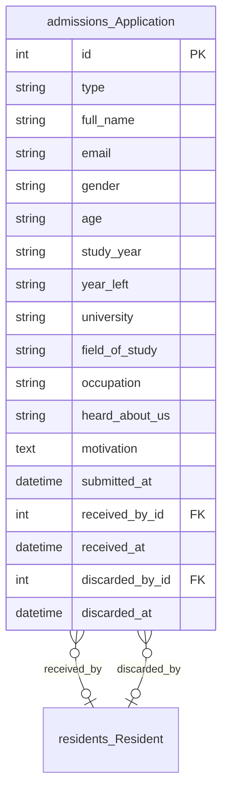

## ak

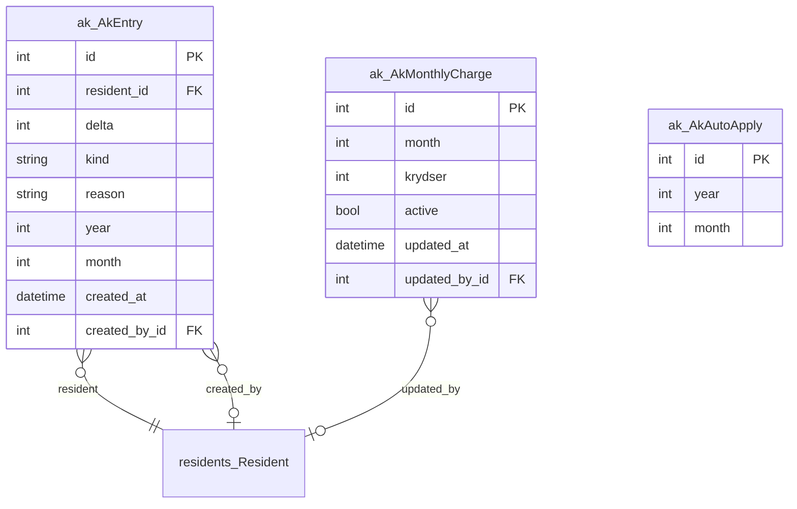

## arkiv

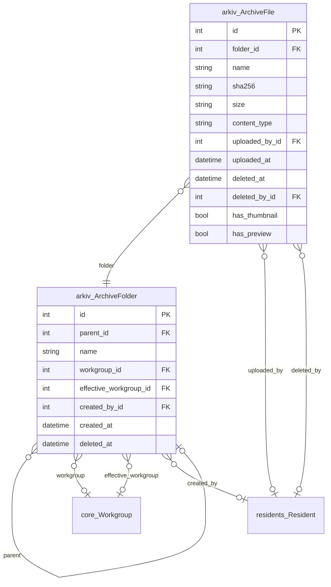

## cms

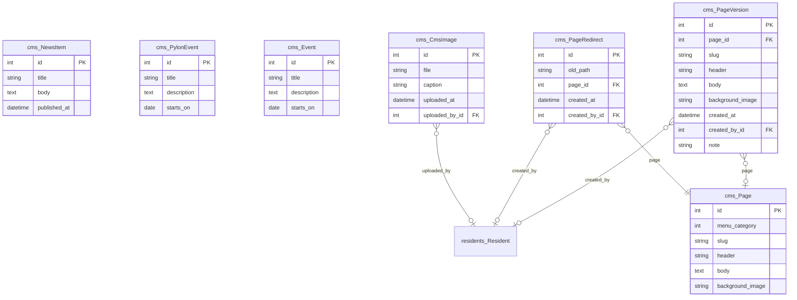

## core

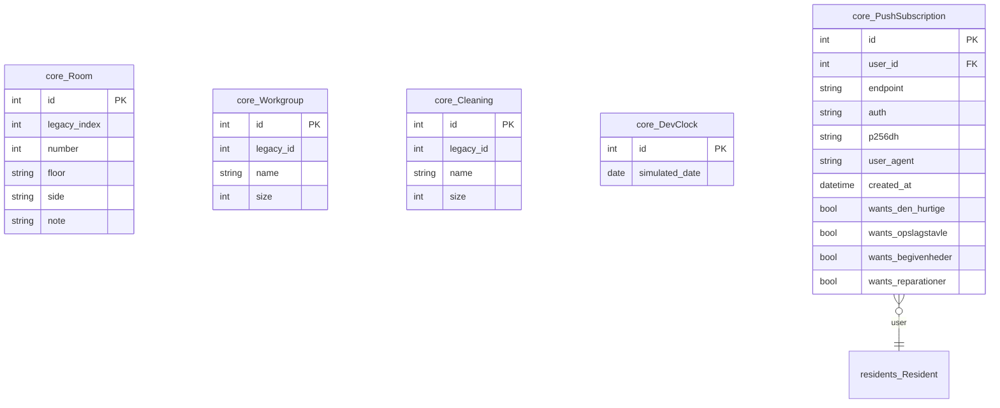

## den_hurtige

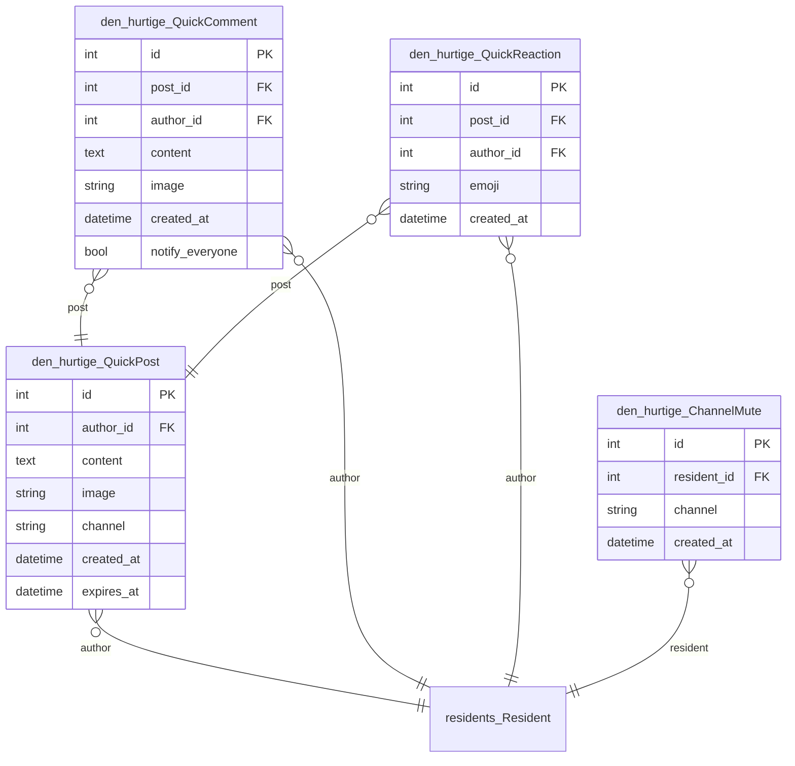

## events

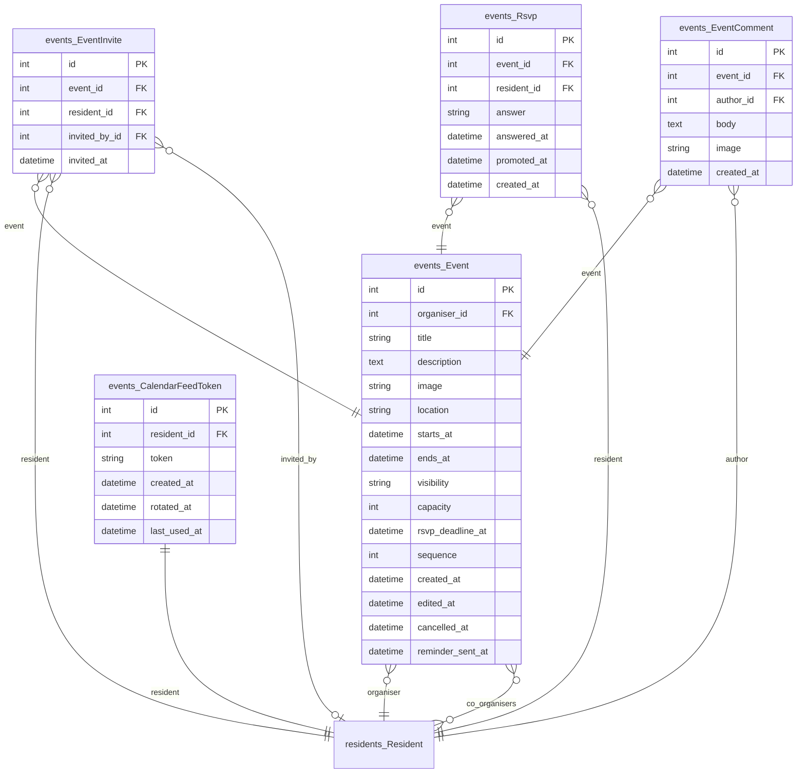

## oelkaelder

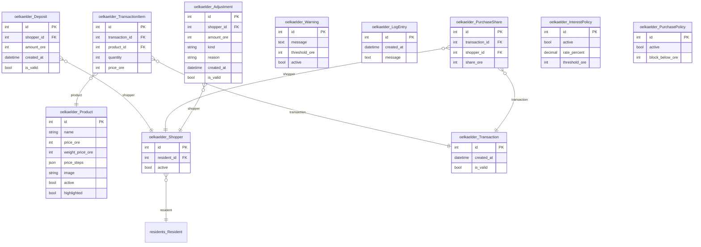

## opslagstavle

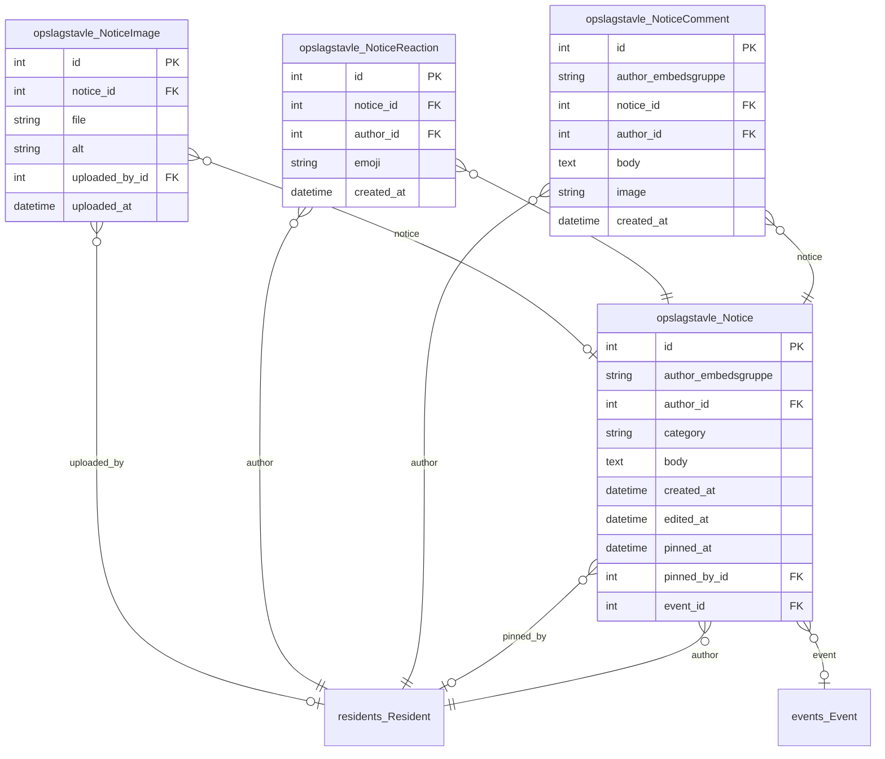

## reparationer

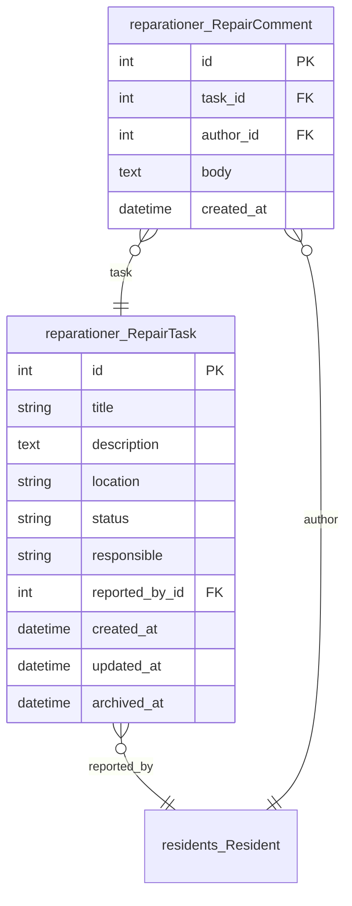

## residents

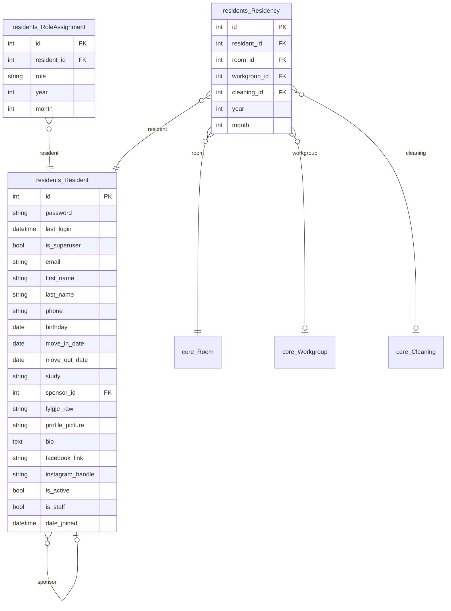

## rooms

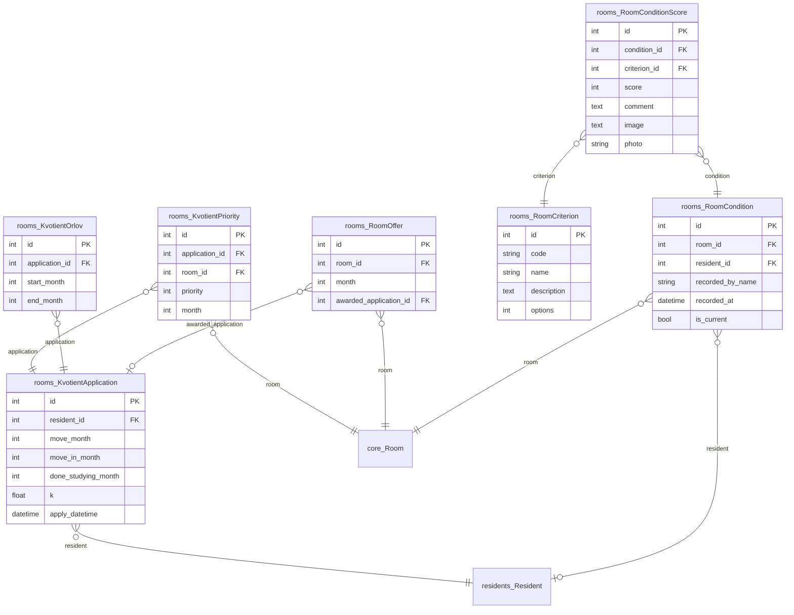

## stats

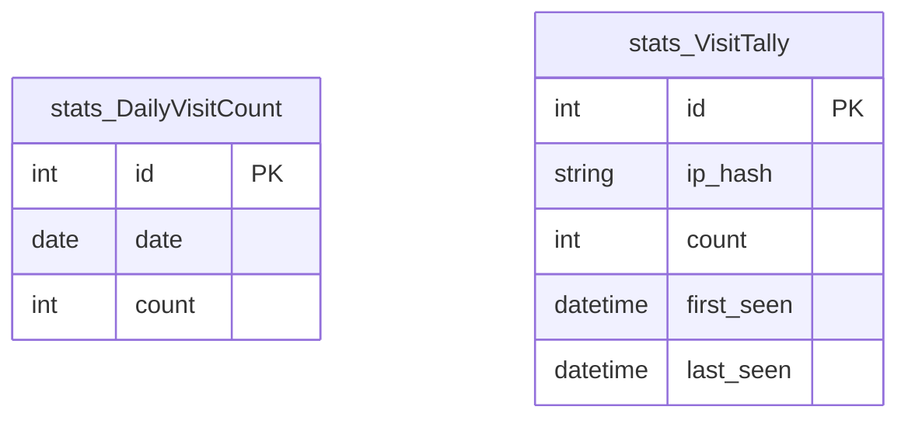
