# Entity Relationship Diagram

> Auto-generated — do not edit by hand. Re-run `uv run python scripts/generate_erd.py` to refresh.
> Cross-app references appear as empty stub entities.

## Full diagram

```mermaid
erDiagram
    audit_AuditEvent {
        int id PK
        datetime at
        string action
        int actor_id FK
        string actor_name
        string source
        string correlation_id
        string ip
        json details
        bool unclaimed
    }

    audit_AuditEntity {
        int id PK
        int event_id FK
        string kind
        int entity_id
        string name
        string operation
        string role
    }

    audit_AuditChange {
        int id PK
        int entity_id FK
        string field
        json before
        json after
        bool redacted
    }

    core_Room {
        int id PK
        int legacy_index
        int number
        string floor
        string side
        string note
    }

    core_Workgroup {
        int id PK
        int legacy_id
        string name
        int size
    }

    core_Cleaning {
        int id PK
        int legacy_id
        string name
        int size
    }

    core_DevClock {
        int id PK
        date simulated_date
    }

    core_PushSubscription {
        int id PK
        int user_id FK
        string endpoint
        string auth
        string p256dh
        string user_agent
        datetime created_at
        datetime last_success_at
        int failure_count
    }

    core_WorkerJobLog {
        int id PK
        string task_id
        string task_name
        string state
        datetime sent_at
        datetime started_at
        datetime finished_at
        string parent_id
        text arguments
        text keyword_arguments
        json lines
        int omitted
        float progress
        string progress_step
        datetime progressed_at
    }

    core_PushDeliveryDay {
        int id PK
        date date
        int delivered
        int failed
        int removed
    }

    core_ServiceHeartbeat {
        int id PK
        string name
        string hostname
        datetime beat_at
    }

    core_OutgoingMail {
        int id PK
        datetime created_at
        text subject
        text recipients
        json payload
        string kind
        string status
        int attempts
        datetime next_attempt_at
        datetime last_attempt_at
        datetime expires_at
        datetime sent_at
        text error
    }

    access_AccessRule {
        int id PK
    }

    access_Grant {
        int id PK
        int account_id FK
        string role
        string reason
        date starts_on
        date ends_on
        int granted_by_id FK
        datetime created_at
    }

    residents_Person {
        int id PK
        string first_name
        string last_name
        date birthday
        string phone
    }

    residents_Resident {
        int id PK
        int person_id FK
        date move_in_date
        date move_out_date
        string study
        int sponsor_id FK
        string fylgje_raw
    }

    residents_Account {
        int id PK
        string password
        datetime last_login
        bool is_superuser
        string email
        int person_id FK
        string first_name
        string last_name
        int economic_account_number
        string profile_picture
        string profile_thumbnail
        text bio
        string facebook_link
        string instagram_handle
        bool is_active
        bool is_staff
        bool is_kitchen
        datetime date_joined
    }

    residents_Residency {
        int id PK
        int resident_id FK
        int room_id FK
        int workgroup_id FK
        int cleaning_id FK
        int year
        int month
    }

    residents_AdminAccessGrant {
        int id PK
        int resident_id FK
        string status
        int requested_by_id FK
        int decided_by_id FK
        datetime decided_at
        datetime created_at
    }

    admissions_Application {
        int id PK
        string type
        string full_name
        string email
        string gender
        string age
        string study_year
        string year_left
        string university
        string field_of_study
        string occupation
        string heard_about_us
        text motivation
        datetime submitted_at
        int received_by_id FK
        datetime received_at
        int discarded_by_id FK
        datetime discarded_at
        string external_id
    }

    cms_Page {
        int id PK
        int menu_category
        string slug
        string header
        text body
        string background_image
        string description
        datetime updated_at
        int updated_by_id FK
    }

    cms_NewsItem {
        int id PK
        string title
        text body
        datetime published_at
    }

    cms_PylonEvent {
        int id PK
        string title
        text description
        date starts_on
    }

    cms_Event {
        int id PK
        string title
        text description
        date starts_on
    }

    cms_CmsImage {
        int id PK
        string file
        string caption
        datetime uploaded_at
        int uploaded_by_id FK
        string sha256
        string content_type
        int size
        string legacy_path
    }

    cms_PageRedirect {
        int id PK
        string old_path
        int page_id FK
        datetime created_at
        int created_by_id FK
    }

    cms_PageVersion {
        int id PK
        int page_id FK
        string slug
        string header
        text body
        string background_image
        string description
        datetime created_at
        int created_by_id FK
        string note
    }

    cms_MenuItem {
        int id PK
        string label
        string url
        int order
    }

    cms_SiteSettings {
        int id PK
        string default_background
    }

    cms_ContentChange {
        int id PK
        datetime at
        int by_id FK
        string by_name
        string action
        string kind
        string object_id
        string label
        json changes
    }

    cms_Publication {
        int id PK
        datetime started_at
        datetime finished_at
        string revision
        string reason
        int triggered_by_id FK
        string status
        text error
        int pages_written
        int images_uploaded
    }

    cms_GahkWebSync {
        int id PK
        datetime status_checked_at
        string remote_version
        string remote_revision
        datetime outbox_pulled_at
        int rejected_applications
        text last_error
        datetime last_error_at
        datetime update_checked_at
        string update_available_version
        string update_result
        text update_error
    }

    ak_AkEntry {
        int id PK
        int resident_id FK
        int delta
        string kind
        string reason
        int year
        int month
        datetime created_at
        int created_by_id FK
    }

    ak_AkMonthlyCharge {
        int id PK
        int month
        int krydser
        bool active
        datetime updated_at
        int updated_by_id FK
    }

    ak_AkAutoApply {
        int id PK
        int year
        int month
    }

    rooms_KvotientApplication {
        int id PK
        int resident_id FK
        int move_month
        int move_in_month
        int done_studying_month
        float k
        datetime apply_datetime
    }

    rooms_KvotientPriority {
        int id PK
        int application_id FK
        int room_id FK
        int priority
        int month
    }

    rooms_KvotientOrlov {
        int id PK
        int application_id FK
        int start_month
        int end_month
    }

    rooms_RoomOffer {
        int id PK
        int room_id FK
        int month
        int awarded_application_id FK
    }

    rooms_RoomCriterion {
        int id PK
        string code
        string name
        text description
        int options
    }

    rooms_RoomCondition {
        int id PK
        int room_id FK
        int resident_id FK
        string recorded_by_name
        datetime recorded_at
        bool is_current
    }

    rooms_RoomConditionScore {
        int id PK
        int condition_id FK
        int criterion_id FK
        int score
        text comment
        text image
        string photo
    }

    oelkaelder_Product {
        int id PK
        string name
        int price_ore
        int weight_price_ore
        json price_steps
        string image
        bool active
        bool highlighted
    }

    oelkaelder_Shopper {
        int id PK
        int resident_id FK
        bool active
    }

    oelkaelder_Deposit {
        int id PK
        int shopper_id FK
        int amount_ore
        datetime created_at
        bool is_valid
    }

    oelkaelder_Transaction {
        int id PK
        datetime created_at
        bool is_valid
    }

    oelkaelder_TransactionItem {
        int id PK
        int transaction_id FK
        int product_id FK
        int quantity
        int price_ore
    }

    oelkaelder_PurchaseShare {
        int id PK
        int transaction_id FK
        int shopper_id FK
        int share_ore
    }

    oelkaelder_Warning {
        int id PK
        text message
        int threshold_ore
        bool active
    }

    oelkaelder_LogEntry {
        int id PK
        datetime created_at
        text message
    }

    oelkaelder_Adjustment {
        int id PK
        int shopper_id FK
        int amount_ore
        string kind
        string reason
        datetime created_at
        bool is_valid
    }

    oelkaelder_InterestPolicy {
        int id PK
        bool active
        decimal rate_percent
        int threshold_ore
    }

    oelkaelder_PurchasePolicy {
        int id PK
        bool active
        int block_below_ore
    }

    stats_DailyVisitCount {
        int id PK
        date date
        int count
    }

    stats_PageViewDay {
        int id PK
        date date
        string path
        int views
        int visitors
    }

    den_hurtige_QuickPost {
        int id PK
        int author_id FK
        text content
        string image
        string channel
        datetime created_at
        datetime expires_at
        datetime deleted_at
    }

    den_hurtige_QuickComment {
        int id PK
        int post_id FK
        int author_id FK
        text content
        string image
        datetime created_at
        bool notify_everyone
    }

    den_hurtige_QuickReaction {
        int id PK
        int post_id FK
        int author_id FK
        string emoji
        datetime created_at
    }

    opslagstavle_Notice {
        int id PK
        string author_embedsgruppe
        int author_id FK
        string category
        text body
        datetime created_at
        datetime edited_at
        datetime pinned_at
        int pinned_by_id FK
        int event_id FK
    }

    opslagstavle_NoticeComment {
        int id PK
        string author_embedsgruppe
        int notice_id FK
        int author_id FK
        text body
        string image
        datetime created_at
    }

    opslagstavle_NoticeReaction {
        int id PK
        int notice_id FK
        int author_id FK
        string emoji
        datetime created_at
    }

    opslagstavle_NoticeImage {
        int id PK
        int notice_id FK
        string file
        string alt
        int uploaded_by_id FK
        datetime uploaded_at
    }

    events_Event {
        int id PK
        int organiser_id FK
        string title
        text description
        string image
        string location
        datetime starts_at
        datetime ends_at
        string visibility
        int capacity
        datetime rsvp_deadline_at
        int sequence
        datetime created_at
        datetime edited_at
        datetime cancelled_at
        datetime reminder_sent_at
    }

    events_EventInvite {
        int id PK
        int event_id FK
        int resident_id FK
        int invited_by_id FK
        datetime invited_at
    }

    events_Rsvp {
        int id PK
        int event_id FK
        int resident_id FK
        string answer
        datetime answered_at
        datetime promoted_at
        datetime created_at
    }

    events_EventComment {
        int id PK
        int event_id FK
        int author_id FK
        text body
        string image
        datetime created_at
    }

    events_CalendarFeedToken {
        int id PK
        int resident_id FK
        string token
        datetime created_at
        datetime rotated_at
        datetime last_used_at
    }

    reparationer_RepairTask {
        int id PK
        string title
        text description
        string location
        string status
        string responsible
        int reported_by_id FK
        datetime created_at
        datetime updated_at
        datetime status_changed_at
        datetime archived_at
    }

    reparationer_RepairComment {
        int id PK
        int task_id FK
        int author_id FK
        text body
        datetime created_at
    }

    reparationer_RepairImage {
        int id PK
        int task_id FK
        int comment_id FK
        string file
        datetime uploaded_at
    }

    photo_album_Tag {
        int id PK
        string name
    }

    photo_album_Album {
        int id PK
        string folder
        string name
        int parent_id FK
        string path
        int depth
        datetime created_at
        datetime manually_locked_at
        datetime unlocked_at
    }

    photo_album_Media {
        int id PK
        int album_id FK
        string uuid
        string title
        string filename
        string sha256
        datetime hash_failed_at
        int size
        string original
        string high_definition
        string thumbnail
        string sidecar
        string content_type
        bool is_raw
        string derivative_state
        int derivative_attempts
        datetime derivative_started_at
        string derivative_task_id
        json metadata
        int requested_by_id FK
        datetime added_at
        datetime captured_at
        bool capture_date_checked
        datetime file_modified_at
        string file_time_source
        datetime sort_at
        string date_source
        string status
        int approved_by_id FK
        datetime approved_at
        datetime deleted_at
        int deleted_by_id FK
    }

    photo_album_AlbumDownload {
        int id PK
        int album_id FK
        int requested_by_id FK
        string name
        string variant
        json media_ids
        string token
        string task_id
        string state
        string archive_key
        string error
        json progress
        datetime progressed_at
        datetime created_at
        datetime completed_at
    }

    photo_album_AlbumImport {
        int id PK
        int requested_by_id FK
        string folder
        string archive_name
        string archive
        string token
        string task_id
        string state
        json album_ids
        json skipped
        json errors
        bool lock_when_done
        bool merge_into_existing
        string album_name
        bool merged
        string error
        json progress
        datetime progressed_at
        datetime created_at
        datetime completed_at
    }

    photo_album_AlbumMerge {
        int id PK
        int target_id FK
        int source_id FK
        string source_path
        int requested_by_id FK
        string task_id
        string state
        json result
        string error
        json progress
        datetime progressed_at
        datetime created_at
        datetime completed_at
        datetime notice_closed_at
    }

    photo_album_MediaView {
        int id PK
        int media_id FK
        int resident_id FK
        int count
        datetime first_viewed_at
        datetime last_viewed_at
    }

    photo_album_StorageReport {
        int id PK
        datetime measured_at
        json totals
        json by_album
        json orphans
        float seconds
    }

    photo_album_FeaturedMedia {
        int id PK
        date date
        int position
        int media_id FK
    }

    notifications_Notification {
        int id PK
        int recipient_id FK
        string category
        int importance
        string title
        string body
        string url
        string group_key
        json actors
        string batch
        bool in_app
        bool pushed
        datetime created_at
        datetime updated_at
        datetime expires_at
        datetime seen_at
    }

    notifications_NotificationPreference {
        int id PK
        int resident_id FK
        string category
        bool in_app
        bool push
        bool vibrate
    }

    notifications_NotificationSettings {
        int id PK
        int resident_id FK
        bool vibrate
        int vibrate_min_importance
    }

    gahkflix_Tag {
        int id PK
        string name
    }

    gahkflix_Series {
        int id PK
        string title
        text description
        int created_by_id FK
        datetime created_at
    }

    gahkflix_Video {
        int id PK
        string uuid
        string title
        text description
        int uploaded_by_id FK
        datetime created_at
        datetime published_at
        date released_on
        string release_precision
        string release_source
        datetime premiere_at
        string premiere_blur
        datetime announced_at
        datetime draft_since
        int series_id FK
        int season
        int episode
        int file_id FK
        string thumbnail
        string banner
        int thumbnail_frame_id FK
        int banner_frame_id FK
        datetime deleted_at
        int deleted_by_id FK
        datetime draft_warned_at
    }

    gahkflix_VideoFile {
        int id PK
        string uuid
        int video_id FK
        int uploaded_by_id FK
        datetime created_at
        string original
        string original_name
        int size
        string content_type
        string fingerprint
        string sha256
        datetime file_modified_at
        string state
        int progress
        string error
        int attempts
        string task_id
        datetime heartbeat_at
        datetime completed_at
        float duration
        int width
        int height
        datetime recorded_at
        string date_guess
        string date_guess_source
        string full_hd
        string hd
        int full_hd_size
        int hd_size
    }

    gahkflix_VideoSubtitle {
        int id PK
        int file_id FK
        string track
        int position
        string language
        string title
        bool is_default
        bool is_forced
    }

    gahkflix_VideoFrame {
        int id PK
        int video_id FK
        string image
        float at_seconds
        int batch
        datetime created_at
    }

    gahkflix_CastMember {
        int id PK
        int video_id FK
        int resident_id FK
        string name
        string role
        int position
    }

    gahkflix_Watch {
        int id PK
        int video_id FK
        int resident_id FK
        int views
        datetime last_viewed_at
        float position
        datetime position_at
        bool finished
    }

    gahkflix_ViewEvent {
        int id PK
        int video_id FK
        int resident_id FK
        datetime opened_at
        datetime viewed_at
        datetime active_at
        float watched
        bool finished
    }

    gahkflix_ChangeRequest {
        int id PK
        string kind
        int video_id FK
        int series_id FK
        int requested_by_id FK
        datetime created_at
        json changes
        text reason
        string state
        datetime decided_at
        string note
    }

    gahkflix_ChangeVote {
        int id PK
        int request_id FK
        int voter_id FK
        bool approve
        string comment
        datetime created_at
    }

    gahkflix_VideoEvent {
        int id PK
        int video_id FK
        string kind
        int actor_id FK
        datetime created_at
        json changes
        int request_id FK
    }

    regnskab_EconomicLedgerEntry {
        int id PK
        int resident_id FK
        int entry_number
        bool is_draft
        date date
        string text
        decimal amount
        string entry_type
        int voucher_number
        date due_date
        datetime synced_at
    }

    regnskab_AlumneregningSettings {
        int id PK
        text message_template
        string followup_pdf
        datetime updated_at
    }

    regnskab_AlumneregningSend {
        int id PK
        int resident_id FK
        date date_from
        date date_to
        string outcome
        text detail
        datetime sent_at
        int mail_id FK
    }

    credit_Holder {
        int id PK
        int person_id FK
        int workgroup_id FK
    }

    credit_Book {
        int id PK
        string name
        int holder_id FK
        int default_credit_limit_ore
        bool is_main
        int closing_months
        datetime created_at
    }

    credit_CreditAccount {
        int id PK
        int book_id FK
        int holder_id FK
        string name
        int credit_limit_ore
        string bank_reference
        int counterpart_book_id FK
        datetime created_at
        datetime closed_at
    }

    credit_Transfer {
        int id PK
        string kind
        datetime created_at
        int created_by_id FK
        string source
        string dedupe_token
        int reverses_id FK
        int companion_of_id FK
    }

    credit_Posting {
        int id PK
        int transfer_id FK
        int account_id FK
        int amount_ore
        int balance_after
        string text
        string prev_hash
        string row_hash
    }

    credit_Anchor {
        int id PK
        string kind
        int book_id FK
        datetime as_of
        datetime made_at
        string root
        int accounts
        string postings
        int previous_id FK
        string anchor_hash
        string signature
        string key_id
    }

    credit_AnchorDelivery {
        int id PK
        int anchor_id FK
        string way
        string target
        bool ok
        text detail
        datetime at
    }

    credit_Closing {
        int id PK
        int book_id FK
        date period_start
        date period_end
        datetime ends_at
        int previous_id FK
        int closed_by_id FK
        datetime closed_at
        text note
        int anchor_id FK
    }

    credit_ClosingBalance {
        int id PK
        int closing_id FK
        int account_id FK
        int balance
        int last_posting_id FK
        string chain_head
        int bank_statement_ore
    }

    credit_Statement {
        int id PK
        int holder_id FK
        int year
        int month
        int anchor_id FK
        text recipients
        string pdf_sha256
        datetime sent_at
    }

    audit_AuditEvent }o--|o residents_Account : "actor"
    audit_AuditEntity }o--|| audit_AuditEvent : "event"
    audit_AuditChange }o--|| audit_AuditEntity : "entity"
    core_PushSubscription }o--|| residents_Account : "user"
    access_Grant }o--|| residents_Account : "account"
    access_Grant }o--|o residents_Account : "granted_by"
    residents_Resident ||--|| residents_Person : "person"
    residents_Resident }o--|o residents_Resident : "sponsor"
    residents_Account ||--|o residents_Person : "person"
    residents_Residency }o--|| residents_Resident : "resident"
    residents_Residency }o--|| core_Room : "room"
    residents_Residency }o--|o core_Workgroup : "workgroup"
    residents_Residency }o--|o core_Cleaning : "cleaning"
    residents_AdminAccessGrant ||--|| residents_Account : "resident"
    residents_AdminAccessGrant }o--|o residents_Account : "requested_by"
    residents_AdminAccessGrant }o--|o residents_Account : "decided_by"
    admissions_Application }o--|o residents_Account : "received_by"
    admissions_Application }o--|o residents_Account : "discarded_by"
    cms_Page }o--|o residents_Account : "updated_by"
    cms_CmsImage }o--|o residents_Account : "uploaded_by"
    cms_PageRedirect }o--|| cms_Page : "page"
    cms_PageRedirect }o--|o residents_Account : "created_by"
    cms_PageVersion }o--|o cms_Page : "page"
    cms_PageVersion }o--|o residents_Account : "created_by"
    cms_ContentChange }o--|o residents_Account : "by"
    cms_Publication }o--|o residents_Account : "triggered_by"
    ak_AkEntry }o--|| residents_Account : "resident"
    ak_AkEntry }o--|o residents_Account : "created_by"
    ak_AkMonthlyCharge }o--|o residents_Account : "updated_by"
    rooms_KvotientApplication }o--|| residents_Account : "resident"
    rooms_KvotientPriority }o--|| rooms_KvotientApplication : "application"
    rooms_KvotientPriority }o--|| core_Room : "room"
    rooms_KvotientOrlov }o--|| rooms_KvotientApplication : "application"
    rooms_RoomOffer }o--|| core_Room : "room"
    rooms_RoomOffer }o--|o rooms_KvotientApplication : "awarded_application"
    rooms_RoomCondition }o--|| core_Room : "room"
    rooms_RoomCondition }o--|o residents_Account : "resident"
    rooms_RoomConditionScore }o--|| rooms_RoomCondition : "condition"
    rooms_RoomConditionScore }o--|| rooms_RoomCriterion : "criterion"
    oelkaelder_Shopper }o--|| residents_Account : "resident"
    oelkaelder_Deposit }o--|| oelkaelder_Shopper : "shopper"
    oelkaelder_TransactionItem }o--|| oelkaelder_Transaction : "transaction"
    oelkaelder_TransactionItem }o--|| oelkaelder_Product : "product"
    oelkaelder_PurchaseShare }o--|| oelkaelder_Transaction : "transaction"
    oelkaelder_PurchaseShare }o--|| oelkaelder_Shopper : "shopper"
    oelkaelder_Adjustment }o--|| oelkaelder_Shopper : "shopper"
    den_hurtige_QuickPost }o--|| residents_Account : "author"
    den_hurtige_QuickComment }o--|| den_hurtige_QuickPost : "post"
    den_hurtige_QuickComment }o--|| residents_Account : "author"
    den_hurtige_QuickReaction }o--|| den_hurtige_QuickPost : "post"
    den_hurtige_QuickReaction }o--|| residents_Account : "author"
    opslagstavle_Notice }o--|| residents_Account : "author"
    opslagstavle_Notice }o--|o residents_Account : "pinned_by"
    opslagstavle_Notice }o--|o events_Event : "event"
    opslagstavle_NoticeComment }o--|| opslagstavle_Notice : "notice"
    opslagstavle_NoticeComment }o--|| residents_Account : "author"
    opslagstavle_NoticeReaction }o--|| opslagstavle_Notice : "notice"
    opslagstavle_NoticeReaction }o--|| residents_Account : "author"
    opslagstavle_NoticeImage }o--|o opslagstavle_Notice : "notice"
    opslagstavle_NoticeImage }o--|o residents_Account : "uploaded_by"
    events_Event }o--|| residents_Account : "organiser"
    events_Event }o--o{ residents_Account : "co_organisers"
    events_EventInvite }o--|| events_Event : "event"
    events_EventInvite }o--|| residents_Account : "resident"
    events_EventInvite }o--|o residents_Account : "invited_by"
    events_Rsvp }o--|| events_Event : "event"
    events_Rsvp }o--|| residents_Account : "resident"
    events_EventComment }o--|| events_Event : "event"
    events_EventComment }o--|| residents_Account : "author"
    events_CalendarFeedToken ||--|| residents_Account : "resident"
    reparationer_RepairTask }o--|| residents_Account : "reported_by"
    reparationer_RepairComment }o--|| reparationer_RepairTask : "task"
    reparationer_RepairComment }o--|| residents_Account : "author"
    reparationer_RepairImage }o--|| reparationer_RepairTask : "task"
    reparationer_RepairImage }o--|o reparationer_RepairComment : "comment"
    photo_album_Album }o--|o photo_album_Album : "parent"
    photo_album_Album }o--o{ photo_album_Tag : "tags"
    photo_album_Media }o--|| photo_album_Album : "album"
    photo_album_Media }o--|| residents_Account : "requested_by"
    photo_album_Media }o--|o residents_Account : "approved_by"
    photo_album_Media }o--|o residents_Account : "deleted_by"
    photo_album_Media }o--o{ photo_album_Tag : "tags"
    photo_album_AlbumDownload }o--|o photo_album_Album : "album"
    photo_album_AlbumDownload }o--|| residents_Account : "requested_by"
    photo_album_AlbumImport }o--|| residents_Account : "requested_by"
    photo_album_AlbumMerge }o--|| photo_album_Album : "target"
    photo_album_AlbumMerge }o--|o photo_album_Album : "source"
    photo_album_AlbumMerge }o--|| residents_Account : "requested_by"
    photo_album_MediaView }o--|| photo_album_Media : "media"
    photo_album_MediaView }o--|| residents_Account : "resident"
    photo_album_FeaturedMedia }o--|| photo_album_Media : "media"
    notifications_Notification }o--|| residents_Account : "recipient"
    notifications_NotificationPreference }o--|| residents_Account : "resident"
    notifications_NotificationSettings ||--|| residents_Account : "resident"
    gahkflix_Series }o--|| residents_Account : "created_by"
    gahkflix_Video }o--|| residents_Account : "uploaded_by"
    gahkflix_Video }o--|o gahkflix_Series : "series"
    gahkflix_Video ||--|o gahkflix_VideoFile : "file"
    gahkflix_Video }o--|o gahkflix_VideoFrame : "thumbnail_frame"
    gahkflix_Video }o--|o gahkflix_VideoFrame : "banner_frame"
    gahkflix_Video }o--|o residents_Account : "deleted_by"
    gahkflix_Video }o--o{ gahkflix_Tag : "tags"
    gahkflix_VideoFile }o--|| gahkflix_Video : "video"
    gahkflix_VideoFile }o--|| residents_Account : "uploaded_by"
    gahkflix_VideoSubtitle }o--|| gahkflix_VideoFile : "file"
    gahkflix_VideoFrame }o--|| gahkflix_Video : "video"
    gahkflix_CastMember }o--|| gahkflix_Video : "video"
    gahkflix_CastMember }o--|o residents_Account : "resident"
    gahkflix_Watch }o--|| gahkflix_Video : "video"
    gahkflix_Watch }o--|| residents_Account : "resident"
    gahkflix_ViewEvent }o--|| gahkflix_Video : "video"
    gahkflix_ViewEvent }o--|| residents_Account : "resident"
    gahkflix_ChangeRequest }o--|o gahkflix_Video : "video"
    gahkflix_ChangeRequest }o--|o gahkflix_Series : "series"
    gahkflix_ChangeRequest }o--|| residents_Account : "requested_by"
    gahkflix_ChangeVote }o--|| gahkflix_ChangeRequest : "request"
    gahkflix_ChangeVote }o--|| residents_Account : "voter"
    gahkflix_VideoEvent }o--|| gahkflix_Video : "video"
    gahkflix_VideoEvent }o--|o residents_Account : "actor"
    gahkflix_VideoEvent }o--|o gahkflix_ChangeRequest : "request"
    regnskab_EconomicLedgerEntry }o--|| residents_Account : "resident"
    regnskab_AlumneregningSend }o--|| residents_Account : "resident"
    regnskab_AlumneregningSend }o--|o core_OutgoingMail : "mail"
    credit_Holder ||--|o residents_Person : "person"
    credit_Holder ||--|o core_Workgroup : "workgroup"
    credit_Book }o--|| credit_Holder : "holder"
    credit_CreditAccount }o--|| credit_Book : "book"
    credit_CreditAccount }o--|| credit_Holder : "holder"
    credit_CreditAccount }o--|o credit_Book : "counterpart_book"
    credit_Transfer }o--|o residents_Account : "created_by"
    credit_Transfer ||--|o credit_Transfer : "reverses"
    credit_Transfer ||--|o credit_Transfer : "companion_of"
    credit_Posting }o--|| credit_Transfer : "transfer"
    credit_Posting }o--|| credit_CreditAccount : "account"
    credit_Anchor }o--|o credit_Book : "book"
    credit_Anchor ||--|o credit_Anchor : "previous"
    credit_AnchorDelivery }o--|| credit_Anchor : "anchor"
    credit_Closing }o--|| credit_Book : "book"
    credit_Closing ||--|o credit_Closing : "previous"
    credit_Closing }o--|| residents_Account : "closed_by"
    credit_Closing ||--|| credit_Anchor : "anchor"
    credit_ClosingBalance }o--|| credit_Closing : "closing"
    credit_ClosingBalance }o--|| credit_CreditAccount : "account"
    credit_ClosingBalance }o--|o credit_Posting : "last_posting"
    credit_Statement }o--|| credit_Holder : "holder"
    credit_Statement }o--|| credit_Anchor : "anchor"
```

## access

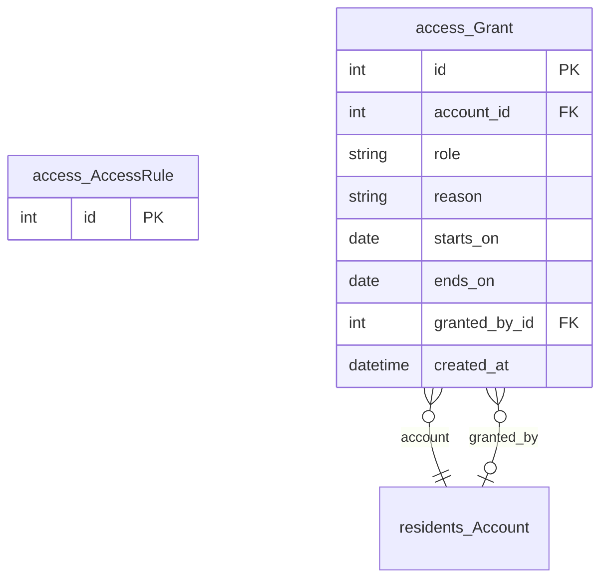
```mermaid
erDiagram
    access_AccessRule {
        int id PK
    }

    access_Grant {
        int id PK
        int account_id FK
        string role
        string reason
        date starts_on
        date ends_on
        int granted_by_id FK
        datetime created_at
    }

    residents_Account { }

    access_Grant }o--|| residents_Account : "account"
    access_Grant }o--|o residents_Account : "granted_by"
```

## admissions

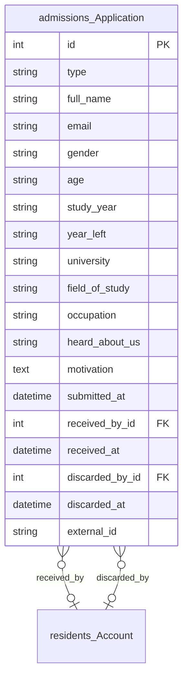
```mermaid
erDiagram
    admissions_Application {
        int id PK
        string type
        string full_name
        string email
        string gender
        string age
        string study_year
        string year_left
        string university
        string field_of_study
        string occupation
        string heard_about_us
        text motivation
        datetime submitted_at
        int received_by_id FK
        datetime received_at
        int discarded_by_id FK
        datetime discarded_at
        string external_id
    }

    residents_Account { }

    admissions_Application }o--|o residents_Account : "received_by"
    admissions_Application }o--|o residents_Account : "discarded_by"
```

## ak

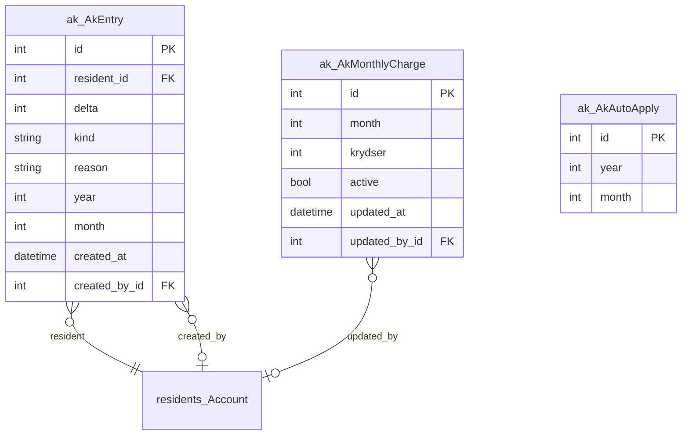
```mermaid
erDiagram
    ak_AkEntry {
        int id PK
        int resident_id FK
        int delta
        string kind
        string reason
        int year
        int month
        datetime created_at
        int created_by_id FK
    }

    ak_AkMonthlyCharge {
        int id PK
        int month
        int krydser
        bool active
        datetime updated_at
        int updated_by_id FK
    }

    ak_AkAutoApply {
        int id PK
        int year
        int month
    }

    residents_Account { }

    ak_AkEntry }o--|| residents_Account : "resident"
    ak_AkEntry }o--|o residents_Account : "created_by"
    ak_AkMonthlyCharge }o--|o residents_Account : "updated_by"
```

## audit

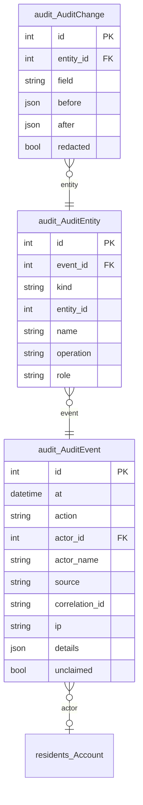
```mermaid
erDiagram
    audit_AuditEvent {
        int id PK
        datetime at
        string action
        int actor_id FK
        string actor_name
        string source
        string correlation_id
        string ip
        json details
        bool unclaimed
    }

    audit_AuditEntity {
        int id PK
        int event_id FK
        string kind
        int entity_id
        string name
        string operation
        string role
    }

    audit_AuditChange {
        int id PK
        int entity_id FK
        string field
        json before
        json after
        bool redacted
    }

    residents_Account { }

    audit_AuditEvent }o--|o residents_Account : "actor"
    audit_AuditEntity }o--|| audit_AuditEvent : "event"
    audit_AuditChange }o--|| audit_AuditEntity : "entity"
```

## cms

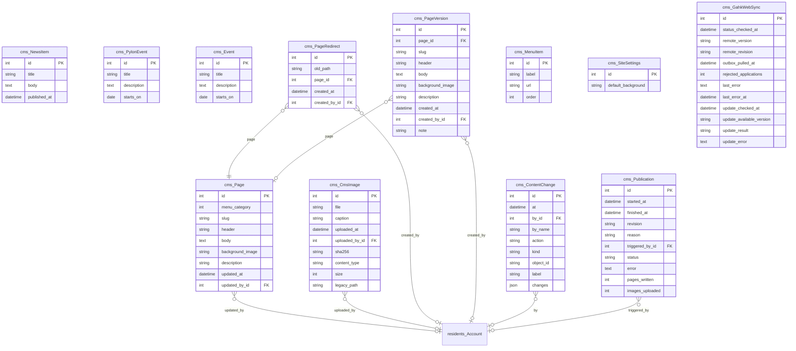
```mermaid
erDiagram
    cms_Page {
        int id PK
        int menu_category
        string slug
        string header
        text body
        string background_image
        string description
        datetime updated_at
        int updated_by_id FK
    }

    cms_NewsItem {
        int id PK
        string title
        text body
        datetime published_at
    }

    cms_PylonEvent {
        int id PK
        string title
        text description
        date starts_on
    }

    cms_Event {
        int id PK
        string title
        text description
        date starts_on
    }

    cms_CmsImage {
        int id PK
        string file
        string caption
        datetime uploaded_at
        int uploaded_by_id FK
        string sha256
        string content_type
        int size
        string legacy_path
    }

    cms_PageRedirect {
        int id PK
        string old_path
        int page_id FK
        datetime created_at
        int created_by_id FK
    }

    cms_PageVersion {
        int id PK
        int page_id FK
        string slug
        string header
        text body
        string background_image
        string description
        datetime created_at
        int created_by_id FK
        string note
    }

    cms_MenuItem {
        int id PK
        string label
        string url
        int order
    }

    cms_SiteSettings {
        int id PK
        string default_background
    }

    cms_ContentChange {
        int id PK
        datetime at
        int by_id FK
        string by_name
        string action
        string kind
        string object_id
        string label
        json changes
    }

    cms_Publication {
        int id PK
        datetime started_at
        datetime finished_at
        string revision
        string reason
        int triggered_by_id FK
        string status
        text error
        int pages_written
        int images_uploaded
    }

    cms_GahkWebSync {
        int id PK
        datetime status_checked_at
        string remote_version
        string remote_revision
        datetime outbox_pulled_at
        int rejected_applications
        text last_error
        datetime last_error_at
        datetime update_checked_at
        string update_available_version
        string update_result
        text update_error
    }

    residents_Account { }

    cms_Page }o--|o residents_Account : "updated_by"
    cms_CmsImage }o--|o residents_Account : "uploaded_by"
    cms_PageRedirect }o--|| cms_Page : "page"
    cms_PageRedirect }o--|o residents_Account : "created_by"
    cms_PageVersion }o--|o cms_Page : "page"
    cms_PageVersion }o--|o residents_Account : "created_by"
    cms_ContentChange }o--|o residents_Account : "by"
    cms_Publication }o--|o residents_Account : "triggered_by"
```

## core

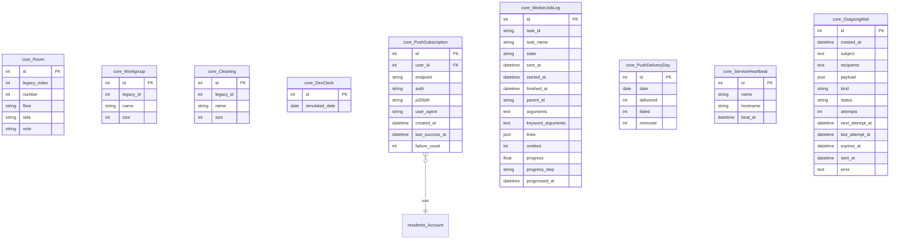
```mermaid
erDiagram
    core_Room {
        int id PK
        int legacy_index
        int number
        string floor
        string side
        string note
    }

    core_Workgroup {
        int id PK
        int legacy_id
        string name
        int size
    }

    core_Cleaning {
        int id PK
        int legacy_id
        string name
        int size
    }

    core_DevClock {
        int id PK
        date simulated_date
    }

    core_PushSubscription {
        int id PK
        int user_id FK
        string endpoint
        string auth
        string p256dh
        string user_agent
        datetime created_at
        datetime last_success_at
        int failure_count
    }

    core_WorkerJobLog {
        int id PK
        string task_id
        string task_name
        string state
        datetime sent_at
        datetime started_at
        datetime finished_at
        string parent_id
        text arguments
        text keyword_arguments
        json lines
        int omitted
        float progress
        string progress_step
        datetime progressed_at
    }

    core_PushDeliveryDay {
        int id PK
        date date
        int delivered
        int failed
        int removed
    }

    core_ServiceHeartbeat {
        int id PK
        string name
        string hostname
        datetime beat_at
    }

    core_OutgoingMail {
        int id PK
        datetime created_at
        text subject
        text recipients
        json payload
        string kind
        string status
        int attempts
        datetime next_attempt_at
        datetime last_attempt_at
        datetime expires_at
        datetime sent_at
        text error
    }

    residents_Account { }

    core_PushSubscription }o--|| residents_Account : "user"
```

## credit

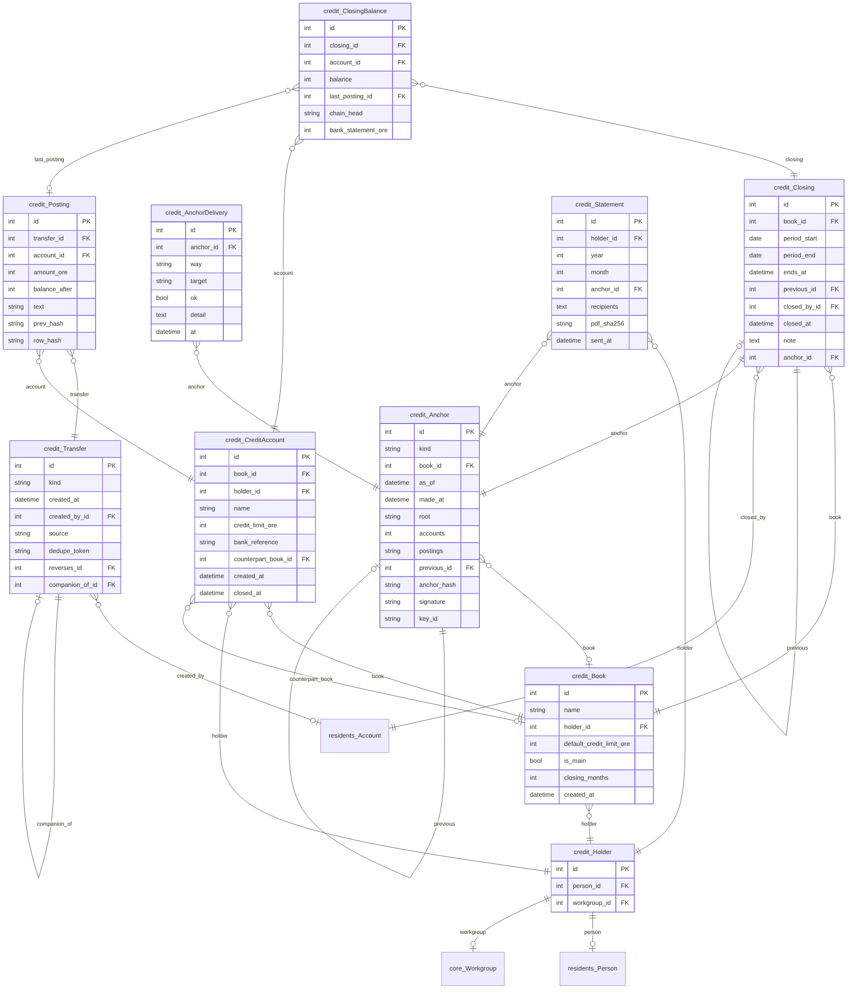
```mermaid
erDiagram
    credit_Holder {
        int id PK
        int person_id FK
        int workgroup_id FK
    }

    credit_Book {
        int id PK
        string name
        int holder_id FK
        int default_credit_limit_ore
        bool is_main
        int closing_months
        datetime created_at
    }

    credit_CreditAccount {
        int id PK
        int book_id FK
        int holder_id FK
        string name
        int credit_limit_ore
        string bank_reference
        int counterpart_book_id FK
        datetime created_at
        datetime closed_at
    }

    credit_Transfer {
        int id PK
        string kind
        datetime created_at
        int created_by_id FK
        string source
        string dedupe_token
        int reverses_id FK
        int companion_of_id FK
    }

    credit_Posting {
        int id PK
        int transfer_id FK
        int account_id FK
        int amount_ore
        int balance_after
        string text
        string prev_hash
        string row_hash
    }

    credit_Anchor {
        int id PK
        string kind
        int book_id FK
        datetime as_of
        datetime made_at
        string root
        int accounts
        string postings
        int previous_id FK
        string anchor_hash
        string signature
        string key_id
    }

    credit_AnchorDelivery {
        int id PK
        int anchor_id FK
        string way
        string target
        bool ok
        text detail
        datetime at
    }

    credit_Closing {
        int id PK
        int book_id FK
        date period_start
        date period_end
        datetime ends_at
        int previous_id FK
        int closed_by_id FK
        datetime closed_at
        text note
        int anchor_id FK
    }

    credit_ClosingBalance {
        int id PK
        int closing_id FK
        int account_id FK
        int balance
        int last_posting_id FK
        string chain_head
        int bank_statement_ore
    }

    credit_Statement {
        int id PK
        int holder_id FK
        int year
        int month
        int anchor_id FK
        text recipients
        string pdf_sha256
        datetime sent_at
    }

    core_Workgroup { }

    residents_Account { }

    residents_Person { }

    credit_Holder ||--|o residents_Person : "person"
    credit_Holder ||--|o core_Workgroup : "workgroup"
    credit_Book }o--|| credit_Holder : "holder"
    credit_CreditAccount }o--|| credit_Book : "book"
    credit_CreditAccount }o--|| credit_Holder : "holder"
    credit_CreditAccount }o--|o credit_Book : "counterpart_book"
    credit_Transfer }o--|o residents_Account : "created_by"
    credit_Transfer ||--|o credit_Transfer : "reverses"
    credit_Transfer ||--|o credit_Transfer : "companion_of"
    credit_Posting }o--|| credit_Transfer : "transfer"
    credit_Posting }o--|| credit_CreditAccount : "account"
    credit_Anchor }o--|o credit_Book : "book"
    credit_Anchor ||--|o credit_Anchor : "previous"
    credit_AnchorDelivery }o--|| credit_Anchor : "anchor"
    credit_Closing }o--|| credit_Book : "book"
    credit_Closing ||--|o credit_Closing : "previous"
    credit_Closing }o--|| residents_Account : "closed_by"
    credit_Closing ||--|| credit_Anchor : "anchor"
    credit_ClosingBalance }o--|| credit_Closing : "closing"
    credit_ClosingBalance }o--|| credit_CreditAccount : "account"
    credit_ClosingBalance }o--|o credit_Posting : "last_posting"
    credit_Statement }o--|| credit_Holder : "holder"
    credit_Statement }o--|| credit_Anchor : "anchor"
```

## den_hurtige

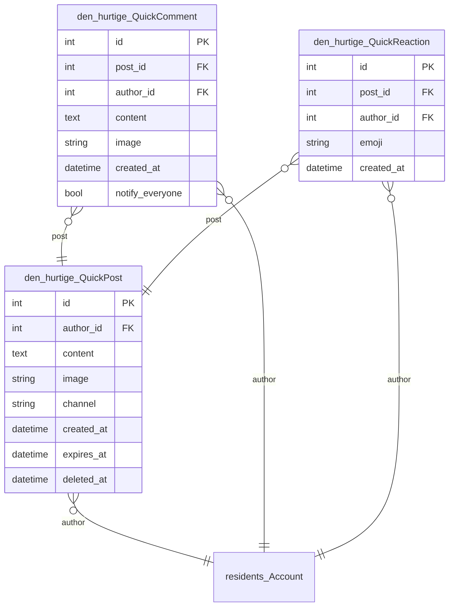
```mermaid
erDiagram
    den_hurtige_QuickPost {
        int id PK
        int author_id FK
        text content
        string image
        string channel
        datetime created_at
        datetime expires_at
        datetime deleted_at
    }

    den_hurtige_QuickComment {
        int id PK
        int post_id FK
        int author_id FK
        text content
        string image
        datetime created_at
        bool notify_everyone
    }

    den_hurtige_QuickReaction {
        int id PK
        int post_id FK
        int author_id FK
        string emoji
        datetime created_at
    }

    residents_Account { }

    den_hurtige_QuickPost }o--|| residents_Account : "author"
    den_hurtige_QuickComment }o--|| den_hurtige_QuickPost : "post"
    den_hurtige_QuickComment }o--|| residents_Account : "author"
    den_hurtige_QuickReaction }o--|| den_hurtige_QuickPost : "post"
    den_hurtige_QuickReaction }o--|| residents_Account : "author"
```

## events

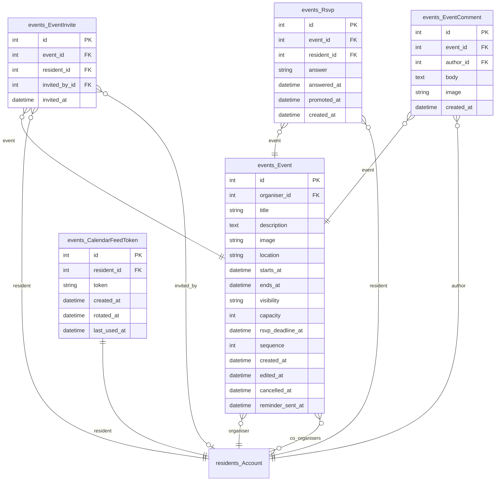
```mermaid
erDiagram
    events_Event {
        int id PK
        int organiser_id FK
        string title
        text description
        string image
        string location
        datetime starts_at
        datetime ends_at
        string visibility
        int capacity
        datetime rsvp_deadline_at
        int sequence
        datetime created_at
        datetime edited_at
        datetime cancelled_at
        datetime reminder_sent_at
    }

    events_EventInvite {
        int id PK
        int event_id FK
        int resident_id FK
        int invited_by_id FK
        datetime invited_at
    }

    events_Rsvp {
        int id PK
        int event_id FK
        int resident_id FK
        string answer
        datetime answered_at
        datetime promoted_at
        datetime created_at
    }

    events_EventComment {
        int id PK
        int event_id FK
        int author_id FK
        text body
        string image
        datetime created_at
    }

    events_CalendarFeedToken {
        int id PK
        int resident_id FK
        string token
        datetime created_at
        datetime rotated_at
        datetime last_used_at
    }

    residents_Account { }

    events_Event }o--|| residents_Account : "organiser"
    events_Event }o--o{ residents_Account : "co_organisers"
    events_EventInvite }o--|| events_Event : "event"
    events_EventInvite }o--|| residents_Account : "resident"
    events_EventInvite }o--|o residents_Account : "invited_by"
    events_Rsvp }o--|| events_Event : "event"
    events_Rsvp }o--|| residents_Account : "resident"
    events_EventComment }o--|| events_Event : "event"
    events_EventComment }o--|| residents_Account : "author"
    events_CalendarFeedToken ||--|| residents_Account : "resident"
```

## gahkflix

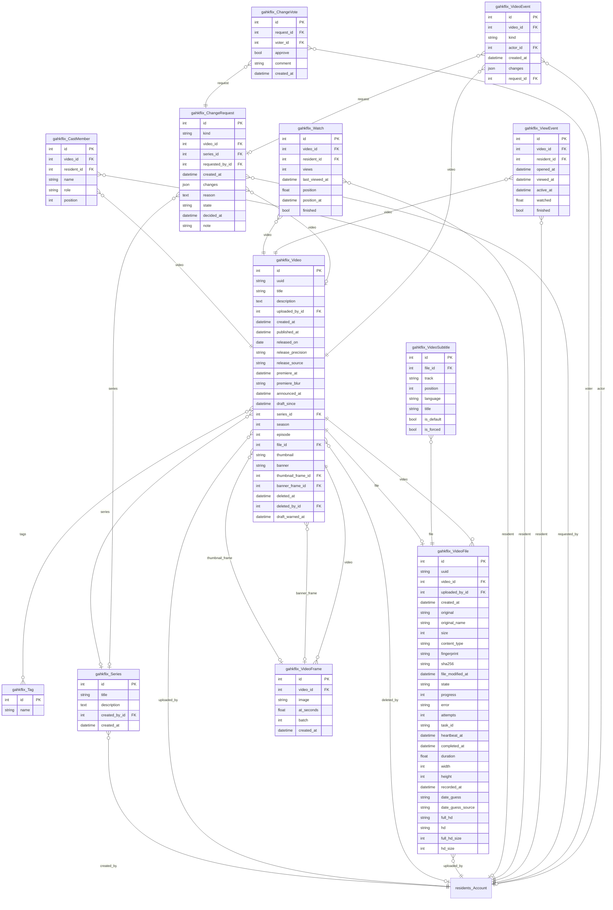
```mermaid
erDiagram
    gahkflix_Tag {
        int id PK
        string name
    }

    gahkflix_Series {
        int id PK
        string title
        text description
        int created_by_id FK
        datetime created_at
    }

    gahkflix_Video {
        int id PK
        string uuid
        string title
        text description
        int uploaded_by_id FK
        datetime created_at
        datetime published_at
        date released_on
        string release_precision
        string release_source
        datetime premiere_at
        string premiere_blur
        datetime announced_at
        datetime draft_since
        int series_id FK
        int season
        int episode
        int file_id FK
        string thumbnail
        string banner
        int thumbnail_frame_id FK
        int banner_frame_id FK
        datetime deleted_at
        int deleted_by_id FK
        datetime draft_warned_at
    }

    gahkflix_VideoFile {
        int id PK
        string uuid
        int video_id FK
        int uploaded_by_id FK
        datetime created_at
        string original
        string original_name
        int size
        string content_type
        string fingerprint
        string sha256
        datetime file_modified_at
        string state
        int progress
        string error
        int attempts
        string task_id
        datetime heartbeat_at
        datetime completed_at
        float duration
        int width
        int height
        datetime recorded_at
        string date_guess
        string date_guess_source
        string full_hd
        string hd
        int full_hd_size
        int hd_size
    }

    gahkflix_VideoSubtitle {
        int id PK
        int file_id FK
        string track
        int position
        string language
        string title
        bool is_default
        bool is_forced
    }

    gahkflix_VideoFrame {
        int id PK
        int video_id FK
        string image
        float at_seconds
        int batch
        datetime created_at
    }

    gahkflix_CastMember {
        int id PK
        int video_id FK
        int resident_id FK
        string name
        string role
        int position
    }

    gahkflix_Watch {
        int id PK
        int video_id FK
        int resident_id FK
        int views
        datetime last_viewed_at
        float position
        datetime position_at
        bool finished
    }

    gahkflix_ViewEvent {
        int id PK
        int video_id FK
        int resident_id FK
        datetime opened_at
        datetime viewed_at
        datetime active_at
        float watched
        bool finished
    }

    gahkflix_ChangeRequest {
        int id PK
        string kind
        int video_id FK
        int series_id FK
        int requested_by_id FK
        datetime created_at
        json changes
        text reason
        string state
        datetime decided_at
        string note
    }

    gahkflix_ChangeVote {
        int id PK
        int request_id FK
        int voter_id FK
        bool approve
        string comment
        datetime created_at
    }

    gahkflix_VideoEvent {
        int id PK
        int video_id FK
        string kind
        int actor_id FK
        datetime created_at
        json changes
        int request_id FK
    }

    residents_Account { }

    gahkflix_Series }o--|| residents_Account : "created_by"
    gahkflix_Video }o--|| residents_Account : "uploaded_by"
    gahkflix_Video }o--|o gahkflix_Series : "series"
    gahkflix_Video ||--|o gahkflix_VideoFile : "file"
    gahkflix_Video }o--|o gahkflix_VideoFrame : "thumbnail_frame"
    gahkflix_Video }o--|o gahkflix_VideoFrame : "banner_frame"
    gahkflix_Video }o--|o residents_Account : "deleted_by"
    gahkflix_Video }o--o{ gahkflix_Tag : "tags"
    gahkflix_VideoFile }o--|| gahkflix_Video : "video"
    gahkflix_VideoFile }o--|| residents_Account : "uploaded_by"
    gahkflix_VideoSubtitle }o--|| gahkflix_VideoFile : "file"
    gahkflix_VideoFrame }o--|| gahkflix_Video : "video"
    gahkflix_CastMember }o--|| gahkflix_Video : "video"
    gahkflix_CastMember }o--|o residents_Account : "resident"
    gahkflix_Watch }o--|| gahkflix_Video : "video"
    gahkflix_Watch }o--|| residents_Account : "resident"
    gahkflix_ViewEvent }o--|| gahkflix_Video : "video"
    gahkflix_ViewEvent }o--|| residents_Account : "resident"
    gahkflix_ChangeRequest }o--|o gahkflix_Video : "video"
    gahkflix_ChangeRequest }o--|o gahkflix_Series : "series"
    gahkflix_ChangeRequest }o--|| residents_Account : "requested_by"
    gahkflix_ChangeVote }o--|| gahkflix_ChangeRequest : "request"
    gahkflix_ChangeVote }o--|| residents_Account : "voter"
    gahkflix_VideoEvent }o--|| gahkflix_Video : "video"
    gahkflix_VideoEvent }o--|o residents_Account : "actor"
    gahkflix_VideoEvent }o--|o gahkflix_ChangeRequest : "request"
```

## notifications

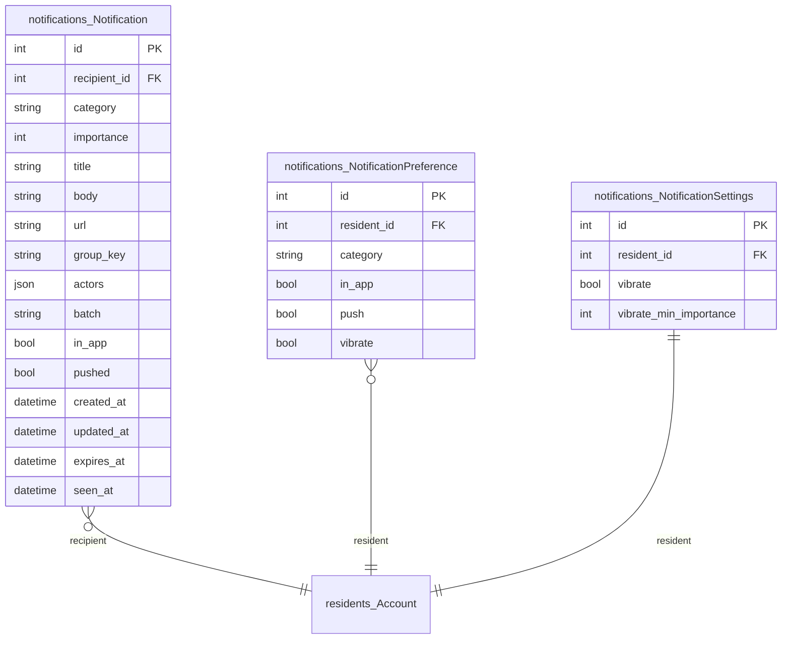
```mermaid
erDiagram
    notifications_Notification {
        int id PK
        int recipient_id FK
        string category
        int importance
        string title
        string body
        string url
        string group_key
        json actors
        string batch
        bool in_app
        bool pushed
        datetime created_at
        datetime updated_at
        datetime expires_at
        datetime seen_at
    }

    notifications_NotificationPreference {
        int id PK
        int resident_id FK
        string category
        bool in_app
        bool push
        bool vibrate
    }

    notifications_NotificationSettings {
        int id PK
        int resident_id FK
        bool vibrate
        int vibrate_min_importance
    }

    residents_Account { }

    notifications_Notification }o--|| residents_Account : "recipient"
    notifications_NotificationPreference }o--|| residents_Account : "resident"
    notifications_NotificationSettings ||--|| residents_Account : "resident"
```

## oelkaelder

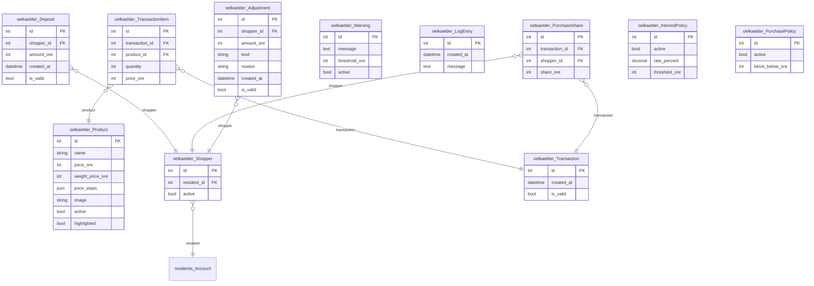
```mermaid
erDiagram
    oelkaelder_Product {
        int id PK
        string name
        int price_ore
        int weight_price_ore
        json price_steps
        string image
        bool active
        bool highlighted
    }

    oelkaelder_Shopper {
        int id PK
        int resident_id FK
        bool active
    }

    oelkaelder_Deposit {
        int id PK
        int shopper_id FK
        int amount_ore
        datetime created_at
        bool is_valid
    }

    oelkaelder_Transaction {
        int id PK
        datetime created_at
        bool is_valid
    }

    oelkaelder_TransactionItem {
        int id PK
        int transaction_id FK
        int product_id FK
        int quantity
        int price_ore
    }

    oelkaelder_PurchaseShare {
        int id PK
        int transaction_id FK
        int shopper_id FK
        int share_ore
    }

    oelkaelder_Warning {
        int id PK
        text message
        int threshold_ore
        bool active
    }

    oelkaelder_LogEntry {
        int id PK
        datetime created_at
        text message
    }

    oelkaelder_Adjustment {
        int id PK
        int shopper_id FK
        int amount_ore
        string kind
        string reason
        datetime created_at
        bool is_valid
    }

    oelkaelder_InterestPolicy {
        int id PK
        bool active
        decimal rate_percent
        int threshold_ore
    }

    oelkaelder_PurchasePolicy {
        int id PK
        bool active
        int block_below_ore
    }

    residents_Account { }

    oelkaelder_Shopper }o--|| residents_Account : "resident"
    oelkaelder_Deposit }o--|| oelkaelder_Shopper : "shopper"
    oelkaelder_TransactionItem }o--|| oelkaelder_Transaction : "transaction"
    oelkaelder_TransactionItem }o--|| oelkaelder_Product : "product"
    oelkaelder_PurchaseShare }o--|| oelkaelder_Transaction : "transaction"
    oelkaelder_PurchaseShare }o--|| oelkaelder_Shopper : "shopper"
    oelkaelder_Adjustment }o--|| oelkaelder_Shopper : "shopper"
```

## opslagstavle

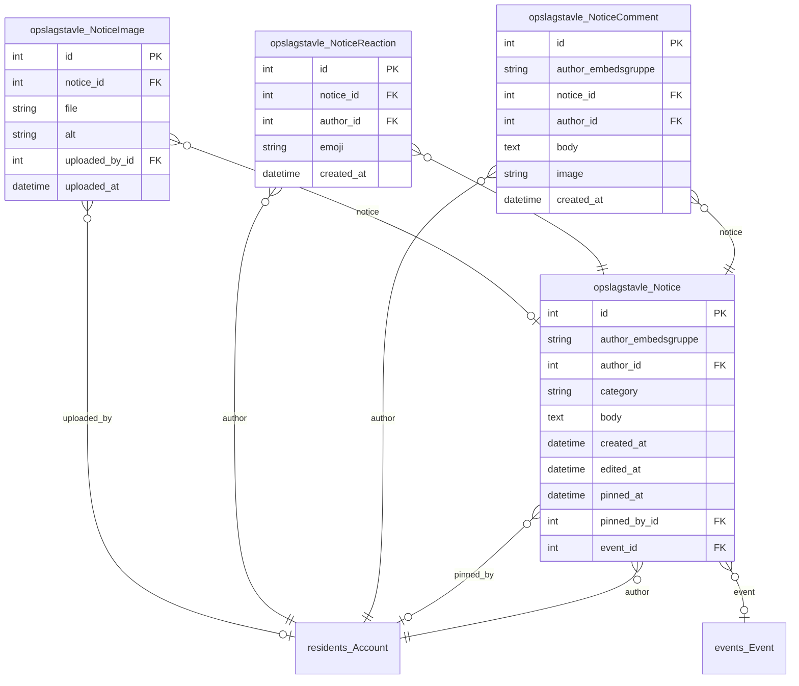
```mermaid
erDiagram
    opslagstavle_Notice {
        int id PK
        string author_embedsgruppe
        int author_id FK
        string category
        text body
        datetime created_at
        datetime edited_at
        datetime pinned_at
        int pinned_by_id FK
        int event_id FK
    }

    opslagstavle_NoticeComment {
        int id PK
        string author_embedsgruppe
        int notice_id FK
        int author_id FK
        text body
        string image
        datetime created_at
    }

    opslagstavle_NoticeReaction {
        int id PK
        int notice_id FK
        int author_id FK
        string emoji
        datetime created_at
    }

    opslagstavle_NoticeImage {
        int id PK
        int notice_id FK
        string file
        string alt
        int uploaded_by_id FK
        datetime uploaded_at
    }

    events_Event { }

    residents_Account { }

    opslagstavle_Notice }o--|| residents_Account : "author"
    opslagstavle_Notice }o--|o residents_Account : "pinned_by"
    opslagstavle_Notice }o--|o events_Event : "event"
    opslagstavle_NoticeComment }o--|| opslagstavle_Notice : "notice"
    opslagstavle_NoticeComment }o--|| residents_Account : "author"
    opslagstavle_NoticeReaction }o--|| opslagstavle_Notice : "notice"
    opslagstavle_NoticeReaction }o--|| residents_Account : "author"
    opslagstavle_NoticeImage }o--|o opslagstavle_Notice : "notice"
    opslagstavle_NoticeImage }o--|o residents_Account : "uploaded_by"
```

## photo_album

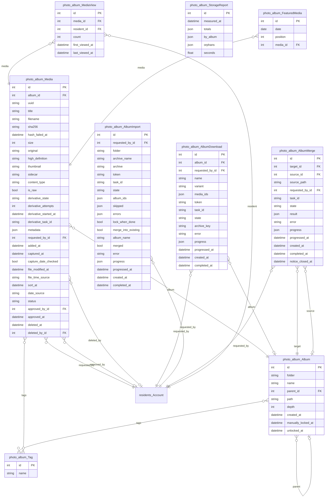
```mermaid
erDiagram
    photo_album_Tag {
        int id PK
        string name
    }

    photo_album_Album {
        int id PK
        string folder
        string name
        int parent_id FK
        string path
        int depth
        datetime created_at
        datetime manually_locked_at
        datetime unlocked_at
    }

    photo_album_Media {
        int id PK
        int album_id FK
        string uuid
        string title
        string filename
        string sha256
        datetime hash_failed_at
        int size
        string original
        string high_definition
        string thumbnail
        string sidecar
        string content_type
        bool is_raw
        string derivative_state
        int derivative_attempts
        datetime derivative_started_at
        string derivative_task_id
        json metadata
        int requested_by_id FK
        datetime added_at
        datetime captured_at
        bool capture_date_checked
        datetime file_modified_at
        string file_time_source
        datetime sort_at
        string date_source
        string status
        int approved_by_id FK
        datetime approved_at
        datetime deleted_at
        int deleted_by_id FK
    }

    photo_album_AlbumDownload {
        int id PK
        int album_id FK
        int requested_by_id FK
        string name
        string variant
        json media_ids
        string token
        string task_id
        string state
        string archive_key
        string error
        json progress
        datetime progressed_at
        datetime created_at
        datetime completed_at
    }

    photo_album_AlbumImport {
        int id PK
        int requested_by_id FK
        string folder
        string archive_name
        string archive
        string token
        string task_id
        string state
        json album_ids
        json skipped
        json errors
        bool lock_when_done
        bool merge_into_existing
        string album_name
        bool merged
        string error
        json progress
        datetime progressed_at
        datetime created_at
        datetime completed_at
    }

    photo_album_AlbumMerge {
        int id PK
        int target_id FK
        int source_id FK
        string source_path
        int requested_by_id FK
        string task_id
        string state
        json result
        string error
        json progress
        datetime progressed_at
        datetime created_at
        datetime completed_at
        datetime notice_closed_at
    }

    photo_album_MediaView {
        int id PK
        int media_id FK
        int resident_id FK
        int count
        datetime first_viewed_at
        datetime last_viewed_at
    }

    photo_album_StorageReport {
        int id PK
        datetime measured_at
        json totals
        json by_album
        json orphans
        float seconds
    }

    photo_album_FeaturedMedia {
        int id PK
        date date
        int position
        int media_id FK
    }

    residents_Account { }

    photo_album_Album }o--|o photo_album_Album : "parent"
    photo_album_Album }o--o{ photo_album_Tag : "tags"
    photo_album_Media }o--|| photo_album_Album : "album"
    photo_album_Media }o--|| residents_Account : "requested_by"
    photo_album_Media }o--|o residents_Account : "approved_by"
    photo_album_Media }o--|o residents_Account : "deleted_by"
    photo_album_Media }o--o{ photo_album_Tag : "tags"
    photo_album_AlbumDownload }o--|o photo_album_Album : "album"
    photo_album_AlbumDownload }o--|| residents_Account : "requested_by"
    photo_album_AlbumImport }o--|| residents_Account : "requested_by"
    photo_album_AlbumMerge }o--|| photo_album_Album : "target"
    photo_album_AlbumMerge }o--|o photo_album_Album : "source"
    photo_album_AlbumMerge }o--|| residents_Account : "requested_by"
    photo_album_MediaView }o--|| photo_album_Media : "media"
    photo_album_MediaView }o--|| residents_Account : "resident"
    photo_album_FeaturedMedia }o--|| photo_album_Media : "media"
```

## regnskab

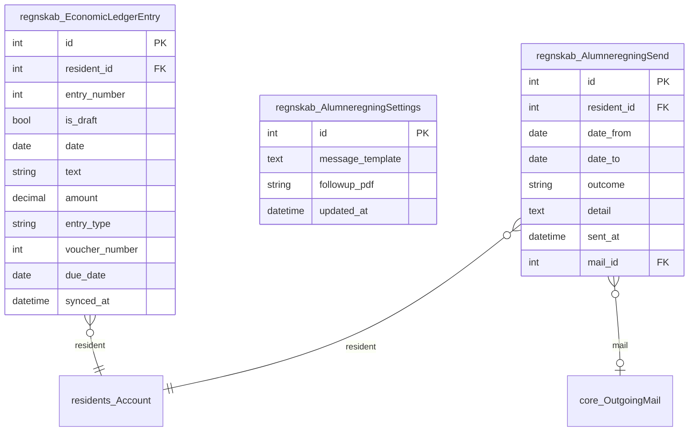
```mermaid
erDiagram
    regnskab_EconomicLedgerEntry {
        int id PK
        int resident_id FK
        int entry_number
        bool is_draft
        date date
        string text
        decimal amount
        string entry_type
        int voucher_number
        date due_date
        datetime synced_at
    }

    regnskab_AlumneregningSettings {
        int id PK
        text message_template
        string followup_pdf
        datetime updated_at
    }

    regnskab_AlumneregningSend {
        int id PK
        int resident_id FK
        date date_from
        date date_to
        string outcome
        text detail
        datetime sent_at
        int mail_id FK
    }

    core_OutgoingMail { }

    residents_Account { }

    regnskab_EconomicLedgerEntry }o--|| residents_Account : "resident"
    regnskab_AlumneregningSend }o--|| residents_Account : "resident"
    regnskab_AlumneregningSend }o--|o core_OutgoingMail : "mail"
```

## reparationer

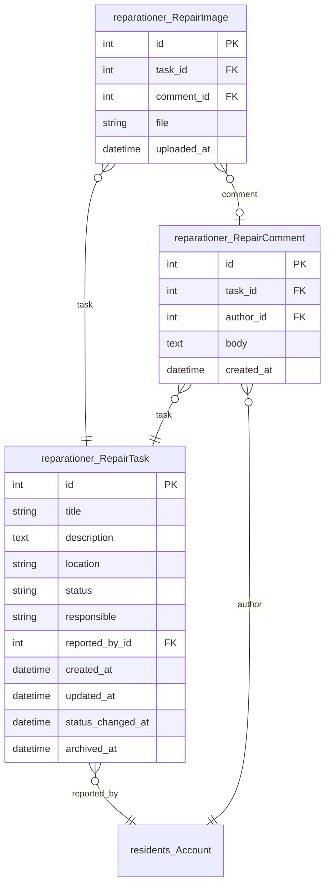
```mermaid
erDiagram
    reparationer_RepairTask {
        int id PK
        string title
        text description
        string location
        string status
        string responsible
        int reported_by_id FK
        datetime created_at
        datetime updated_at
        datetime status_changed_at
        datetime archived_at
    }

    reparationer_RepairComment {
        int id PK
        int task_id FK
        int author_id FK
        text body
        datetime created_at
    }

    reparationer_RepairImage {
        int id PK
        int task_id FK
        int comment_id FK
        string file
        datetime uploaded_at
    }

    residents_Account { }

    reparationer_RepairTask }o--|| residents_Account : "reported_by"
    reparationer_RepairComment }o--|| reparationer_RepairTask : "task"
    reparationer_RepairComment }o--|| residents_Account : "author"
    reparationer_RepairImage }o--|| reparationer_RepairTask : "task"
    reparationer_RepairImage }o--|o reparationer_RepairComment : "comment"
```

## residents

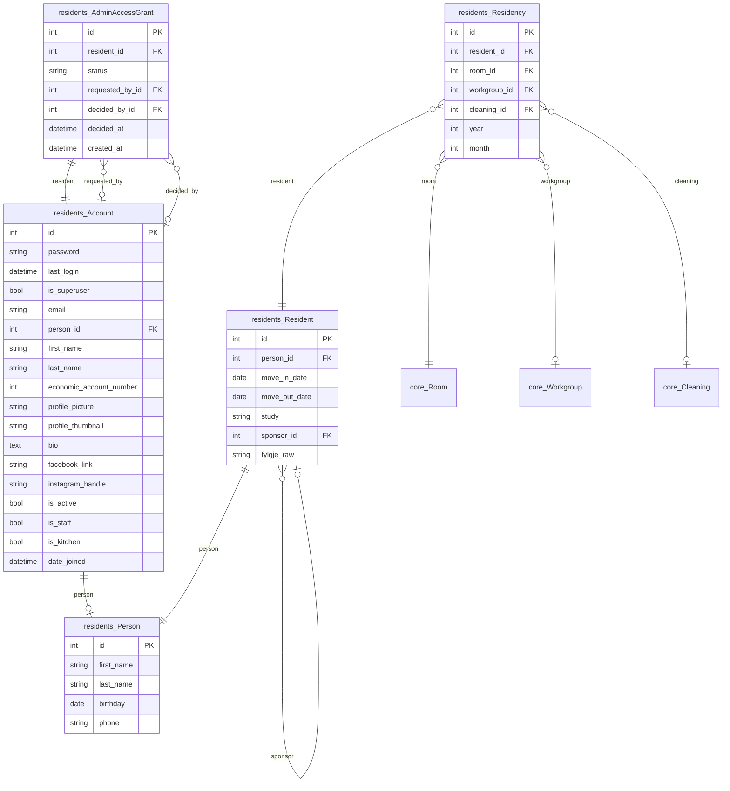
```mermaid
erDiagram
    residents_Person {
        int id PK
        string first_name
        string last_name
        date birthday
        string phone
    }

    residents_Resident {
        int id PK
        int person_id FK
        date move_in_date
        date move_out_date
        string study
        int sponsor_id FK
        string fylgje_raw
    }

    residents_Account {
        int id PK
        string password
        datetime last_login
        bool is_superuser
        string email
        int person_id FK
        string first_name
        string last_name
        int economic_account_number
        string profile_picture
        string profile_thumbnail
        text bio
        string facebook_link
        string instagram_handle
        bool is_active
        bool is_staff
        bool is_kitchen
        datetime date_joined
    }

    residents_Residency {
        int id PK
        int resident_id FK
        int room_id FK
        int workgroup_id FK
        int cleaning_id FK
        int year
        int month
    }

    residents_AdminAccessGrant {
        int id PK
        int resident_id FK
        string status
        int requested_by_id FK
        int decided_by_id FK
        datetime decided_at
        datetime created_at
    }

    core_Cleaning { }

    core_Room { }

    core_Workgroup { }

    residents_Resident ||--|| residents_Person : "person"
    residents_Resident }o--|o residents_Resident : "sponsor"
    residents_Account ||--|o residents_Person : "person"
    residents_Residency }o--|| residents_Resident : "resident"
    residents_Residency }o--|| core_Room : "room"
    residents_Residency }o--|o core_Workgroup : "workgroup"
    residents_Residency }o--|o core_Cleaning : "cleaning"
    residents_AdminAccessGrant ||--|| residents_Account : "resident"
    residents_AdminAccessGrant }o--|o residents_Account : "requested_by"
    residents_AdminAccessGrant }o--|o residents_Account : "decided_by"
```

## rooms

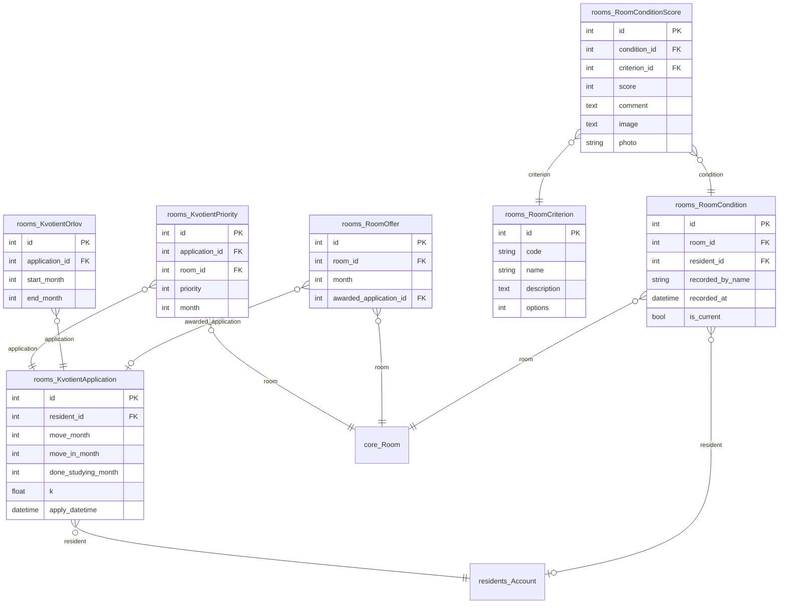
```mermaid
erDiagram
    rooms_KvotientApplication {
        int id PK
        int resident_id FK
        int move_month
        int move_in_month
        int done_studying_month
        float k
        datetime apply_datetime
    }

    rooms_KvotientPriority {
        int id PK
        int application_id FK
        int room_id FK
        int priority
        int month
    }

    rooms_KvotientOrlov {
        int id PK
        int application_id FK
        int start_month
        int end_month
    }

    rooms_RoomOffer {
        int id PK
        int room_id FK
        int month
        int awarded_application_id FK
    }

    rooms_RoomCriterion {
        int id PK
        string code
        string name
        text description
        int options
    }

    rooms_RoomCondition {
        int id PK
        int room_id FK
        int resident_id FK
        string recorded_by_name
        datetime recorded_at
        bool is_current
    }

    rooms_RoomConditionScore {
        int id PK
        int condition_id FK
        int criterion_id FK
        int score
        text comment
        text image
        string photo
    }

    core_Room { }

    residents_Account { }

    rooms_KvotientApplication }o--|| residents_Account : "resident"
    rooms_KvotientPriority }o--|| rooms_KvotientApplication : "application"
    rooms_KvotientPriority }o--|| core_Room : "room"
    rooms_KvotientOrlov }o--|| rooms_KvotientApplication : "application"
    rooms_RoomOffer }o--|| core_Room : "room"
    rooms_RoomOffer }o--|o rooms_KvotientApplication : "awarded_application"
    rooms_RoomCondition }o--|| core_Room : "room"
    rooms_RoomCondition }o--|o residents_Account : "resident"
    rooms_RoomConditionScore }o--|| rooms_RoomCondition : "condition"
    rooms_RoomConditionScore }o--|| rooms_RoomCriterion : "criterion"
```

## stats

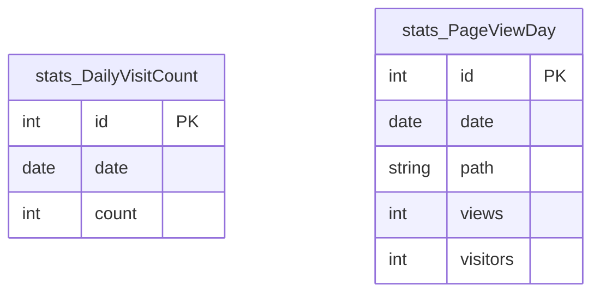
```mermaid
erDiagram
    stats_DailyVisitCount {
        int id PK
        date date
        int count
    }

    stats_PageViewDay {
        int id PK
        date date
        string path
        int views
        int visitors
    }
```
